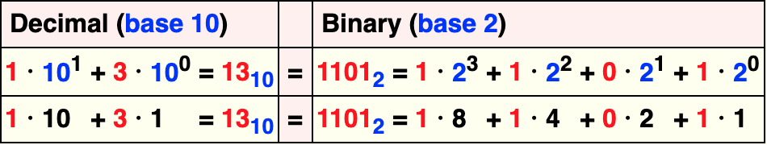

<!-- _class: lead -->
# 程序员
## 浮点数不完全指南

zhuyie
zhuyie@gmail.com

---
# Agenda
* 数及数的表示
* IEEE 754 标准简介
* 浮点数格式
* 舍入规则
* 字节序
* 基础运算的实现方式
* 非规格化浮点数
* 半精度浮点数
* 量化

---
<!-- paginate: true -->
# 二进制计算机可以原生表示哪些数？

complex number?
irrational numbers? [1](https://www.zhihu.com/question/364786025)

---
# 计算机如何表示整数
作为程序员，应该很容易理解整数在计算机中的表示方式。


---
# 计算机如何表示分数(小数)
类似的概念也可以用来表示小数。


---
# IEEE 754 标准简介
* 由Institute of Electrical and Electronics Engineers (IEEE)在1985年初次发布，2008年和2019年有两次版本修订。
* 标准定义了：
  * arithmetic formats (形式化描述)
  * interchange formats (编码为bit strings的方式)
  * rounding rules (舍入规则)
  * operations (加减乘除/三角函数/类型转换/大小比较等)
  * exception handling (除0，溢出等)

---
# 浮点数格式 I
存在多种浮点数格式。某种浮点数格式由以下3个参数来定义：
* 基数(base or radix) b，在IEEE 754中有两种取值，2或者10。
* 精度(precision) p。
* 指数(exponent)范围：emin to emax, with emin = 1 − emax for all IEEE 754 formats.

---
# 浮点数格式 II
* 一个普通的浮点数由以下3个部分来描述：
  * s = 符号位(sign)，0或1。
  * c = 有效数字或尾数(significand/coefficient/mantissa)，以基数b的形式来书写，最多p位数字。 
  * q = 指数值(exponent)，满足条件emin ≤ q + p − 1 ≤ emax。
* 其值为：

---
# 浮点数格式 III
举例：设b=10, p=7, emax=96, 因此emin=−95。
* 尾数部分满足0 ≤ c ≤ 9999999，指数部分满足−101 ≤ q ≤ 90。 
* 可表示的最小非0正数为：1×10^−101，最大数为：9999999×10^90 (9.999999×10^96)，因此其最大表示范围是：−9.999999×10^96至9.999999×10^96。
* 量级上最小的规格化浮点数是-1x10^-95和1x10^-95; 其它位于两数之间的非0数被称为非规则浮点数(subnormal numbers)。
* 存在两个0，+0和-0。

---
# 浮点数格式 IV
除了前述的普通浮点数，浮点数格式中还包括如下特殊值：
* Two infinities: +∞ and −∞.
* Two kinds of NaN (not-a-number): a quiet NaN (qNaN) and a signaling NaN (sNaN).

---
# 表示和编码方式
* 一个数可能有多种指数化表示方式。例如b=10及p=7，则−12.345可以表示为−12345×10^−3,−123450×10^−4,−1234500×10^−5。
* 对于decimal formats，所有表示都是有效的，标准中定义了在存在多种表示时选择哪一个的规则。
* 对于binary formats, 标准要求使用exponent值最小的那种表示。此外，exponent并非直接表示，而是要加上一个**bias**使得最小可表示的exponent为1，从而保留出0值来表示subnormal numbers。
* 标准要求对数进行**规格化**处理，也就是调整exponent使得significant的leading digit不为0。对于binary normal numbers，其尾数的leading bit无需实际存储，从而可以多出1 bit来提高精度。

---
# Basic and interchange formats
标准定义了5种基本格式(basic formats)：binary32, binary64, binary128, decimal64, decimal128。

 

---
# 支持非binary base浮点数的计算机
In 1964, IBM introduced **hexadecimal** floating-point representations in its System/360 mainframes; these same representations are still available for use in modern z/Architecture systems. However, in 1998, IBM included IEEE-compatible **binary** floating-point arithmetic to its mainframes; in 2005, IBM also added IEEE-compatible **decimal** floating-point arithmetic.

POWER6, POWER7, and POWER8 CPUs that implement IEEE 754-2008 **decimal** arithmetic fully in **hardware**.

---
# Layout
binary32，单精度浮点数，对应C中的float。

```plaintext
   e = 01111100 = 0x7C = 124; 124 - 127(bias) = -3
   c = 1.01；移位后为0.00101；
       1x2^-3+1x2^-5 = 0.125+0.03125 = 0.15625；
```
binary64，双精度浮点数，对应C中的double。


---
# 舍入规则 I
* 当significant的位数大于最大精度位数时，就需要进行舍入操作(Rounding)。
* IEEE 754定义了5种Rounding规则，分别是：
  * Round to nearest, ties to even (**default** for binary floating point)
  * Round to nearest, ties away from zero
  * Round toward 0 (also known as truncation)
  * Round toward +∞ (also known as ceiling)
  * Round toward −∞ (also known as floor)

---
# 舍入规则 II
* Round to nearest, ties to even
  - rounds to the nearest value; if the number falls midway, it is rounded to the nearest value with an even least significant digit;
* Round to nearest, ties away from zero
  - rounds to the nearest value; if the number falls midway, it is rounded to the nearest value above (for positive numbers) or below (for negative numbers);

---
# 舍入规则 III


---
# 字节序(Endianness)
* 我们知道在网络通讯或者文件存储时，如果遇到short/long等整数类型，需要考虑字节序问题，因为不同的体系架构中字节序可能是不同的。Windows/Unix均提供了htons/htonl/ntohs/ntohl系列函数来实现主机字节序与网络字节序的相互转换。
* 那么浮点数是否需要考虑字节序问题呢？
* 答案是需要。浮点数需要多字节存储，同时又是基础类型(CPU中有浮点类型的寄存器)，其字节序是体系架构相关的。
* 多数体系架构中，浮点数和整数采用同样的字节序，另外一些奇葩的机器我们一般碰不到[1](https://en.wikipedia.org/wiki/Endianness#Floating_point)。比较糟心的是没有统一的htonf/ntohf函数，很多时候需要自行实现。

---
# 浮点数基础运算
* 简要介绍加/减/乘/除的实现规则，以及浮点数和整数互转的规则。
* 参考[Floating-point arithmetic operations](https://en.wikipedia.org/wiki/Floating-point_arithmetic#Floating-point_arithmetic_operations)。
* 为了便于理解和展示，例子是以decimal32格式、限制为7位精度来进行介绍的，但其基础原理同样适用于binary32, binary64等标准格式。

---
# 加法 I
首先将两个操作数进行对阶，也就是调整两数中阶码较小的那个数，移动其小数点位置，使得两数的阶码相等。
```plaintext
  123456.7 = 1.234567 × 10^5
  101.7654 = 1.017654 × 10^2 = 0.001017654 × 10^5
  
  e=5; s=1.234567 (123456.7)
+ e=2; s=1.017654 (101.7654) ==> e=5; s=0.001017654
```

---
# 加法 II
尾数部分相加，指数部分保持不变。
```plaintext
  123456.7 + 101.7654 = (1.234567 × 10^5) + (1.017654 × 10^2)
                      = (1.234567 × 10^5) + (0.001017654 × 10^5)
                      = (1.234567 + 0.001017654) × 10^5
                      =  1.235584654 × 10^5

  e=5;  s=1.234567
+ e=5;  s=0.001017654  (after shifting)
---------------------
  e=5;  s=1.235584654  (true sum: 123558.4654)
```

---
# 加法 III
根据精度进行舍入处理，并进行规格化处理。由于我们限定为7位精度，因此出现了round-off error，丢失了部分精度。
```plaintext
  e=5;  s=1.235585    (final sum: 123558.5)
```

---
# 加法 IV
另一个加法出现精度错误的例子：两个非零浮点数相加的结果可能等于其中较大的那个。
```plaintext
  e=5;  s=1.234567    (123456.7)
+ e=−3; s=9.876543    (0.009876543)
```
```plaintext
  e=5;  s=1.234567
+ e=5;  s=0.00000009876543 (after shifting)
--------------------------
  e=5;  s=1.23456709876543 (true sum)
  e=5;  s=1.234567         (after rounding and normalization)
```

---
# 减法
与加法的逻辑基本一致，首先对阶，然后尾数执行减法，最后进行舍入和规格化处理。
```plaintext
  e=5;  s=1.234571 (123457.1)
− e=5;  s=1.234567 (123456.7)
------------------
  e=5;  s=0.000004
  e=−1; s=4.000000 (after rounding and normalization)
```

---
# 乘法和除法
无需对阶，对指数部分执行加法/减法，对尾数部分执行乘法/除法，再进行舍入和规格化处理。
```plaintext
  e=3;  s=4.734612
× e=5;  s=5.417242
-------------------------
  e=8;  s=25.648538980104 (true product)
  e=8;  s=25.64854        (after rounding)
  e=9;  s=2.564854        (after normalization)
```

---
# 浮点数和整数互转
* 浮点数转换为整形时，小数部分将被丢弃，例如：567.8 => 567
* FP32的表示范围大于INT32，双精度同理。printf("%f", FLT_MAX) => 340282346638528859811704183484516925440.000000
* float(2147483648.000000 //INT_MAX+1) => int(-2147483648)
* 绝对值<=2^24的整数可以无损的用FP32来表示，否则将采用近似表示。
* 参考测试程序operations.c。

---
# 非规格化浮点数 I
* denormal numbers, denormalized numbers, subnormal numbers
* 在规格化的浮点数中，尾数(significant)不能含有前导0(leading zeros)。前导0通过调整exponent的方式进行移除。问题是exponent的表示范围是有限的，当移除前导0时所需的exponent值小于当前格式的最小可表示exponent值时，就无法用规格化的方式来表示了。
* 这时候有两种选择：flush to zero on underflow, 或者是使用另一种表示方式(也就是subnormal)。
* subnormal numbers的exponent为一个固定的特殊值，significant的leading digit允许为0。

---
# 非规格化浮点数 II
* Pros
  - 确保所有当前格式能表示的浮点数之间的加法/减法运算，永远不会出现下溢出(underflow)。
  - 不会underflow意味着不会出现意外的division by zero错误。
* Cons
  - 相比规格化浮点数，计算性能显著降低。
  - 参考测试程序denormalized.c。

---
# 半精度浮点数：FP16
* Nvidia and Microsoft defined the **half** datatype in the Cg language, released in early 2002.
* 在IEEE 754-2008中被标准化，正式名称是**binary16**。
* 编码方式不变，只是调整了位宽：
* 在较新的GPU中有原生支持。

---
# 半精度浮点数：bfloat16
* Google在Tensorflow中引入。
* 可以通过直接丢弃FP32的低16位来获得，也就是保留符号位(1位)、指数位(8位)和部分尾数位(7位)。相当于用**更低的精度**换取了**更大的动态范围**。
* 更大的动态范围意味着出现下溢出的风险更小，相比FP16降低了因为梯度消失(过小)而无法训练的风险。
* TPU原生支持，主流CPU/GPU均不原生支持。
* References: [1](https://cloud.google.com/tpu/docs/bfloat16) [2](https://www.zhihu.com/question/275682777)

---
# 量化(quantization)
* 将浮点数（一般指FP32）转换为16位/8位(/4位/2位/1位)整数，并基于后者来进行存储/计算。
* Pros:
  - 降低带宽(bandwidth)和存储(storage)需求。
  - 提升计算速度。
* Cons:
  - 可能损失精度。

---
# 量化实现方法
V_quant = Q * (V_x - V_min)
V_quant_revert = V_quant / Q + V_min

Q = S / R
R = V_max - V_min
S = 1 << quant_bits - 1

其中，V_x表示原始浮点输入，V_quant表示量化后的定点数值，V_quant_revert是根据量化参数还原出的浮点数，quant_bits表示量化位数(1~32)。

---
# 量化的效能提升
以FP32量化为INT8为例(单个number由4个字节降为1个字节)：
* 磁盘上的模型文件更小，加载到内存所需时间更少，占用内存更小。
* 整数运算由于逻辑简单，通常比浮点数运算要快。参考测试程序speed.c。
* 在支持SIMD指令的环境中，以带128位寄存器的SSE为例，单条指令可以同时操作4个FP32、8个INT16、16个INT8。INT8的执行速度会更快。
* 在利用GPU加速计算时，显著减少Host to Device的通讯耗时。
* 更小的空间占用和更快的执行速度，也就更省电。

---
# 量化对精度的影响
影响因子：
- 待量化浮点数的取值范围(及均匀分布程度) => 值域范围
- 量化比特数 => 描述能力
- References: [1](https://zhuanlan.zhihu.com/p/38328685)

---
<!-- _class: lead -->
# That's all.