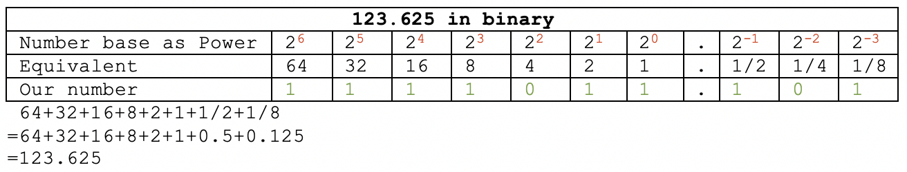

<!-- _class: lead -->
# 程序员
## 浮点数不完全指南

zhuyie
zhuyie@gmail.com

---
# Agenda
- 基础概念
- IEEE 754 标准简介
- 浮点数格式
- 舍入规则
- 基础运算的实现方式
- 非规格化浮点数
- 半精度浮点数
- 量化

---
<!-- paginate: true -->
# 二进制计算机可以原生表示哪些数？


---
# Decimal Fraction


---
# Binary Fraction



---
# Binary-Coded Decimal
* 单个10进制数字有10种状态，可以用4个2进制bit来完整表示。
* 我们常见的计算机都采用8个bit组成1个字节，因此BCD一般采用packed形式，即用1个字节表示2个10进制数字。
* 优点：能精确表示0.1这种binary fraction无法精确表示的数。
* 缺点：存储密度较低，实现数学运算的电路复杂度较高。

---
# Scientific notation


---
# Normalized scientific notation
* 350 can be written as ```3.5×10^2``` or ```35×10^1``` or ```350×10^0```.
* 其中significand部分```大于0且小于base```的那种形式，被称为normalized形式。就上例而言，是```3.5x10^2```。
* 得到normalized形式表示的方法是调整exponent。

---
# Fixed point notation
* 一个数可以视为**整数部分+小数部分**。对应的可以将用于表示此种数据类型的若干个bit分为两部分，一部分bit表示整数部分，另一部分bit表示小数部分。
* 可以定义出多类采用这种方式的表示法(例如16.16, 28.4)，在具体某一类中，其整数部分和小数部分所占用的bit数是固定的，也即小数点的位置是固定的。因此这种表示法被称为**定点数**。

---
# Fixed point notation (cont.)
* 相比于整数，定点数相当于牺牲了一部分bit位来表示小数部分，因此其**表示范围**相应减小。
  * 整数可以视为一种小数部分占0 bit的特殊形式的定点数。
* 定点数的**精度**是固定的。
* 定点数概念简单，可基于整数运算逻辑来实现，很适合在没有FPU的低端计算设备中使用。

---
# Floating point notation
* 地球到太阳的距离（量级）：10^11 m
* 原子间的距离（量级）：10^-10 m
* 当描述这两类距离时，显然应该有不同的**精度**要求。具体而言：数值量级越大，精度要求可以较低，而数值量级越小时，精度要求会越高。
* 那能否有一种数据格式，既能表示较大的**数值范围**，也能在数值量级较小时提供很高的**精度**呢？
  * **浮点数**就是这种数据格式。
  * 采用了**科学计数法**的思路。

---
# IEEE 754 标准简介
* 由Institute of Electrical and Electronics Engineers (IEEE)在1985年初次发布，2008年和2019年有两次版本修订。
* 标准定义了：
  * arithmetic formats
  * interchange formats
  * rounding rules
  * operations
  * exception handling

---
# 浮点数格式
存在多种浮点数格式。某种浮点数格式由以下3个参数来定义：
* 基数(base or radix) b，在IEEE 754中有两种取值，2或者10。
* 精度(precision) p。
* 指数(exponent)范围：emin to emax, with emin = 1 − emax for all IEEE 754 formats.

---
# 浮点数格式 (cont.)
* 一个浮点数由以下三部分组成：
  * s = 符号位(sign)，0或1。
  * c = 有效数字或尾数(significand/coefficient/mantissa)，以基数b的形式来书写，最多p位数字。 
  * q = 指数值(exponent)，满足条件emin ≤ q + p − 1 ≤ emax。
* 其值为：
* 逻辑上就是一种科学计数法表示。

---
# 浮点数格式 (cont. 2)
* 当base=2时，若采用normalized scientific notation则尾数必定为```1.xxxx```的形式。
  * 最前面的```1```可以不存储，进而可以多出来一个bit来表示尾数(提高精度)。因此base=2的浮点数**默认要求**存储为normalized形式。
  * 如何表示0?
    * 当exponent值为某特殊值时，significand部分按另一套规则来解释。
* base=10的浮点数不强制要求normalized形式。why?

---
# 浮点数格式 (cont. 3)
* 使用一个单独的符号位来表示正数还是负数。
  * 存在两个0，```+0```和```-0```。
  * 现代二进制计算机中的有符号整数，通过使用补码(Two's complement)的方式，避免了两个0的问题。

---
# 浮点数格式 (cont. 4)
* 指数部分存在正值也存在负值。
  * 再引入1位符号位，还是使用补码表示？
* 引入biased表示法：
  * 真正的exponent值，需要加上一个```bias```再存储，使得emin实际存储为1。
  * 将实际存储中的0值和最大值保留下来，用于表示```0, ∞```等特殊值。

---
# Special values


---
# Basic and interchange formats
标准定义了5种基本格式(basic formats)：binary32, binary64, binary128, decimal64, decimal128。
 

---
# 10进制浮点数
* As with binary interchange, the encoding scheme for the decimal interchange formats encodes the **sign, exponent, and significand**.
* The **significand** can be encoded as a compressed sequence of decimal digits using [densely packed decimal](https://en.wikipedia.org/wiki/Densely_packed_decimal) or, alternatively, as a [binary integer](https://en.wikipedia.org/wiki/Binary_integer_decimal).

---
# 支持非binary base浮点数的计算机
In 1964, IBM introduced **hexadecimal** floating-point representations in its System/360 mainframes; these same representations are still available for use in modern z/Architecture systems. However, in 1998, IBM included IEEE-compatible **binary** floating-point arithmetic to its mainframes; in 2005, IBM also added IEEE-compatible **decimal** floating-point arithmetic.

POWER6, POWER7, and POWER8 CPUs that implement IEEE 754-2008 **decimal** arithmetic fully in **hardware**.

---
# Layout
binary32，单精度浮点数，对应C中的float。

```plaintext
   e = 01111100 = 0x7C = 124; 124 - 127(bias) = -3
   c = 1.01；移位后为0.00101；
       1x2^-3 + 1x2^-5 = 0.125+0.03125 = 0.15625；
```
binary64，双精度浮点数，对应C中的double。


---
# 舍入规则
* 当significant的位数大于最大精度位数时，就需要进行舍入操作(Rounding)。
* IEEE 754定义了5种Rounding规则，分别是：
  * Round to nearest, ties to even (**default** for binary floating point)
  * Round to nearest, ties away from zero
  * Round toward 0 (also known as truncation)
  * Round toward +∞ (also known as ceiling)
  * Round toward −∞ (also known as floor)

---
# 舍入规则 (cont.)

References: [1](https://stackoverflow.com/questions/6867693/change-floating-point-rounding-mode) [2](https://en.cppreference.com/w/c/numeric/fenv/feround)

---
# 浮点数基础运算
* 简要介绍加/减/乘/除的实现规则，以及浮点数和整数互转的规则。
* 参考[Floating-point arithmetic operations](https://en.wikipedia.org/wiki/Floating-point_arithmetic#Floating-point_arithmetic_operations)。
* 为了便于理解和展示，例子是以decimal32格式、限制为7位精度来进行介绍的，但其基础原理同样适用于binary32, binary64等标准格式。

---
# 加法
首先将两个操作数进行**对阶**，也就是调整两数中阶码较小的那个数，移动其小数点位置，使得两数的阶码相等。
```plaintext
  123456.7 + 101.7654 = ?

  123456.7 = 1.234567 × 10^5
  101.7654 = 1.017654 × 10^2
  
  e=5; s=1.234567 (123456.7)
+ e=2; s=1.017654 (101.7654) ==> e=5; s=0.001017654
```

---
# 加法 (cont.)
尾数部分相加，指数部分保持不变。
```plaintext
  123456.7 + 101.7654 = (1.234567 × 10^5) + (1.017654 × 10^2)
                      = (1.234567 × 10^5) + (0.001017654 × 10^5)
                      = (1.234567 + 0.001017654) × 10^5
                      =  1.235584654 × 10^5

  e=5;  s=1.234567
+ e=5;  s=0.001017654  (after shifting)
---------------------
  e=5;  s=1.235584654  (true sum: 123558.4654)
```

---
# 加法 (cont. 2)
根据精度进行舍入处理，并进行规格化处理。由于我们限定为7位精度，因此出现了round-off error，丢失了部分精度。
```plaintext
  e=5;  s=1.235585    (final sum: 123558.5)
```

---
# 加法 (cont. 3)
另一个加法出现精度错误的例子：两个非零浮点数相加的结果可能等于其中较大的那个。
```plaintext
  e=5;  s=1.234567    (123456.7)
+ e=−3; s=9.876543    (0.009876543)
```
```plaintext
  e=5;  s=1.234567
+ e=5;  s=0.00000009876543 (after shifting)
--------------------------
  e=5;  s=1.23456709876543 (true sum)
  e=5;  s=1.234567         (after rounding and normalization)
```

---
# 减法
和加法类似。首先对阶，然后尾数执行减法，最后进行舍入和规格化处理。
```plaintext
  e=5;  s=1.234571 (123457.1)
− e=5;  s=1.234567 (123456.7)
------------------
  e=5;  s=0.000004
  e=−1; s=4.000000 (after rounding and normalization)
```

---
# 乘法和除法
无需对阶，对指数部分执行加法/减法操作，对尾数部分执行乘法/除法操作，再进行舍入和规格化处理。
```plaintext
  e=3;  s=4.734612
× e=5;  s=5.417242
-------------------------
  e=8;  s=25.648538980104 (true product)
  e=8;  s=25.64854        (after rounding)
  e=9;  s=2.564854        (after normalization)
```

---
# 和整数运算的差异
* 结果和**运算顺序**密切相关。
* not necessarily **associative**: (a+b)+c 不一定等于 a+(b+c)
* not necessarily **distributive**: (a+b)c 不一定等于 ac+bc

---
# 浮点数和整数互转
* 浮点数转换为整数时，小数部分将被丢弃，例如：```567.8 => 567```
* 整数转换为浮点数时：
  * FP32的数值表示**范围**大于INT32，双精度同理。``` printf("%f", FLT_MAX) => 340282346638528859811704183484516925440.000000 ```
  * FP32和INT32能表示的不同数值的个数都是~2^32。
  * 浮点数类型采用**动态精度**，离0值越远其精度越低，超过一个阈值之后，相邻的两个浮点数的数值差将大于1。
  * 对于FP32而言，绝对值<=2^24的整数可以无损表示，否则将采用近似表示。why?

---
# 非规格化浮点数
* denormal numbers, denormalized numbers, subnormal numbers
* 在规格化的浮点数中，尾数(significant)不能含有前导0(leading zeros)。前导0通过调整exponent的方式进行移除。
* 对于非常小的值例如```0.000000000000000000000000000000000123```，调整后的exponent值可能超出了当前格式中exponent的表示范围，此时无法用规格化的方式来表示这个值。
* 这时候有两种选择：flush to zero on underflow, 或者是使用另一种表示方式(也即subnormal)。
* subnormal numbers的exponent为一个固定的特殊值，significant的leading digit允许为0。

---
# 非规格化浮点数 (cont.)
* Pros
  - 增加了正/负p个bit的数值空间来表示非常接近0的小数。
  - 确保所有当前格式能表示的浮点数之间的加法/减法运算，永远不会出现下溢出(underflow)。
  - 不会underflow意味着不会出现意外的division by zero错误。
* Cons
  - 相比规格化浮点数，计算性能显著降低。
  - 参考测试程序denormalized.c。

---
# 半精度浮点数：FP16
* Nvidia and Microsoft defined the **half** datatype in the Cg language, released in early 2002.
* 在IEEE 754-2008中被标准化，正式名称是**binary16**。
* 编码方式不变，只是调整了位宽：
* 在较新的GPU中有原生支持。

---
# 半精度浮点数：bfloat16
* 由Google提出，'b' stands for "brain"
* 通过直接丢弃FP32的低16位来获得，也就是保留符号位(1位)、指数位(8位)和部分尾数位(7位)。相比于FP16是用**更低的精度**换取了**更大的动态范围**。
* 更大的动态范围意味着出现下溢出的风险更小，相比FP16降低了因为梯度消失(过小)而无法训练的风险。
* 主要在AI相关的加速器(例如Google TPU)中有支持。
* References: [1](https://cloud.google.com/tpu/docs/bfloat16) [2](https://www.zhihu.com/question/275682777) [3](https://nhigham.com/2018/12/03/half-precision-arithmetic-fp16-versus-bfloat16/)

---
# 量化(quantization)
* 在AI领域一般指将**浮点数**转换为较小比特位的**整数**，并基于后者来进行存储和计算。
* Pros:
  - 降低带宽(bandwidth)和存储(storage)需求。
  - 提升计算速度。
* Cons:
  - 可能损失精度。
* References: [1](https://zhuanlan.zhihu.com/p/38328685) [2](https://jackwish.net/2019/neural-network-quantization-introduction-chn.html)

---
# 量化实现方法
一种比较简单的做法是利用离差标准化的思路：
```plaintext
V_quant = Q * (V_x - V_min)
V_quant_revert = V_quant / Q + V_min

R = V_max - V_min
S = 1 << quant_bits - 1
Q = S / R
```
其中，V_x表示原始浮点输入，V_quant表示量化后的定点数值，V_quant_revert是根据量化参数还原出的浮点数，quant_bits表示量化位数(1~32)。

---
# 量化的效能提升
以FP32量化为INT8为例(单个number由4个字节降为1个字节)：
* 磁盘上的模型文件更小，加载到内存所需时间更少，占用内存更小。
* 整数运算由于逻辑简单，通常比浮点数运算要快。参考测试程序speed.c。
* 在支持SIMD指令的环境中，以带128位寄存器的SSE为例，单条指令可以同时操作4个FP32、8个INT16、16个INT8。INT8的执行速度会更快。
* 在利用GPU加速计算时，降低Host to Device的通讯耗时。

---
<!-- _class: lead -->
# Q & A