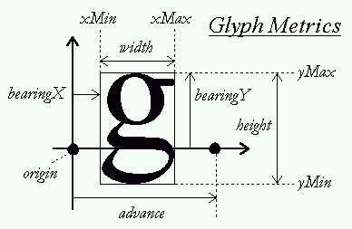
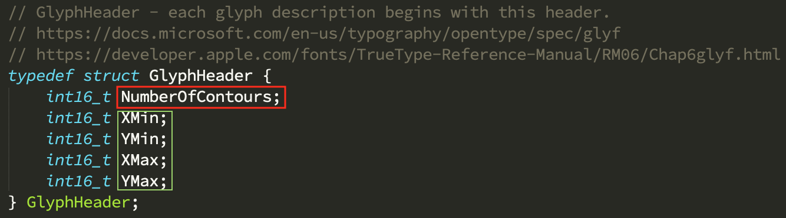
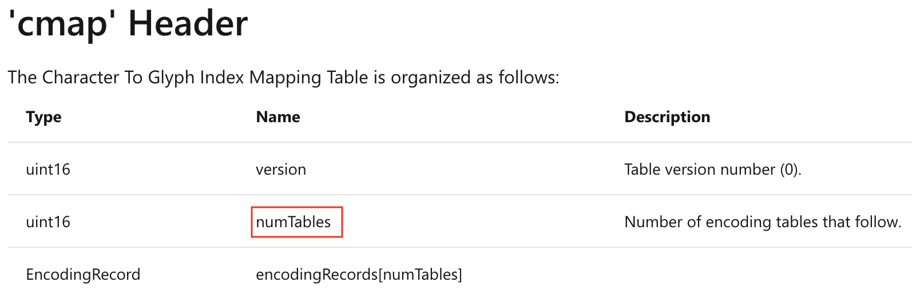
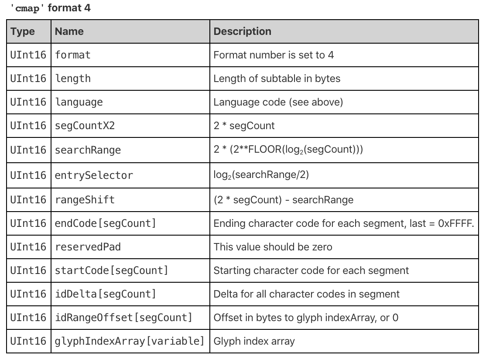

<!-- _class: lead -->
# 字体和排版学基础
zhuyie
zhuyie@gmail.com

---
# Agenda
Part 1. 基础概念
Part 2. 字体格式
Part 3. 字体的应用

---
<!-- paginate: true -->
<!-- _class: lead -->
# Part 1. 基础概念

---
# Character, Glyph
* 字符（Character）是指在书面语言中具备语义价值的最小组成部分。
* 字符具有多种编码系统（或称为**字符集**），例如ASCII, GB2312, Unicode。
* 字形（Glyph）是字符的**图形化**表示。
* 同一个字符'A'可能有很多种不同的字形（在不同的字体中）；单个字形也可能同时表示多个字符（例如ligature形式的'fi'）。

---
# Font, Font family
* 字体（Font）是一组字形（Glyph）的集合，用于字符（Character）的显示或打印。
* 同一字体中的多个字形一般具有相同的**设计风格**。
* 字体中一般存在额外的**转换表**，能够将某种字符编码值映射到特定的字形。
* 遵循同一设计风格，但在粗细、倾斜角度、长宽比例上进行变化以适应不同用途的若干个字体，一般称为字体家族（Font family），例如Arial **Regular**, Arial **Italic**, Arial **Bold**, Arial **Bold Italic**。

---
# Serif
* 衬线体（Serif）是一种有衬线的字体，而没有衬线的字体则被称为无衬线体。衬线是**字形笔画的起始段与末端的装饰细节部分**。

* 东亚语言中也有衬线的存在。

---
# Proportional versus Monospaced
* 比例字体（Proportional font）是指不同字符的宽度存在不一致的字体。与之相对应的是等宽字体（Monospaced font）。

* 一般认为，比例字体显示更美观易读。而等宽字体是因为早期打印机及显示终端的技术限制而生，当前主要应用于界面UI（例如浏览器下载文件时的状态文本在更新时要避免跳动）和文本编辑器（特别是程序员所用的编辑器）。

---
# Font weight
* 字重（weight），是指相对于字高度的笔画粗细（stroke width）程度。

---
# Italic or oblique
* 斜体为什么叫意大利体（Italic）？因为比萨斜塔吗？
* 意大利体（Italic）是一种手写体印刷字形，它的字形稍微向右倾斜，其字母写法也接近于手写体。这种字形起源于文艺复兴时代的意大利，并因此得名。
* 在电脑字体的语境中，意大利体（**Italic**）除了字形倾斜，其字形结构相比正体也会发生变化，是通过设计而得到的**真斜体**。而基于正体进行简单几何变形得到的斜体（**Oblique**）被称为**伪斜体**。
* 在实践中一般都没有分的这么细，两个词大体通用。

---
# Typography
* 字体排印学（typography）又称为文字设计，是通过排版使得文字**易认、可读和优美**的技艺。
* 是一个相对复杂的领域，需要遵循众多的规则。

---
# EM square
* EM在传统排印中指的是铅字印刷术中的一个个金属字模的高度。同一套字模有着相同的高度（这样才能刚好排在一行）。
* 不同的字母可能有着不同的宽度，但'M'的字模一般都被设计为正方形，因此这个大小单位也被称为EM square。
* 

---
# EM square (cont.)
* 在现代数字排印中，EM square指的是用于**设计**字形（Glyph）的假想平面空间。
* 不同的字体可能设置不同的EM大小，TrueType字体一般为1024或2048，OpenType字体一般为1000。
* 字体设计师在这个**坐标系**（例如TrueType的1024x1024）中定义轮廓，进而设计出一个个Glyph。

---
# EM square (cont. 2)

---
# Font size
* 字体尺寸一般使用绝对单位，最常用的单位是point（点，1/72英寸）。
* 设置字号为n points，也即将该字体的1个EM square缩放到n points的大小。
* 字体设计师可以选择不同的EM占用比例（在EM中较大还是较小），因此同一段文字应用不同字体的相同字号时，其高度通常不同。
 

---
# Baseline, pens and layouts
* 基线（baseline）是一条用于指导Glyph排布的假想线。
* 布局方向（layout）是指排版时文本的延伸方向，拉丁语一般为水平方向，中文、日文等亚洲语言可能会出现垂直方向。
* Pen位置或原点（pen position/origin），是一个用来定位Glyph的虚拟点。

---
# Baseline, pens and layouts (cont.)
* 水平布局时，一个个Glyph可以假想为平齐的落在基线上，其原点刚好在基线上，按照每个Glyph自己的宽度来向前推进。

---
# Baseline, pens and layouts (cont. 2)
* 垂直布局时，基线也是一条垂直线，Glyph按照基线进行水平居中，并在垂直方向上推进。

---
# Font metrics
* 
* **ascent**: 从基线到字体轮廓的最高点的距离。
* **descent**: 从基线到字体轮廓最低点的距离，一般是一个负值（设基线的Y坐标=0）。
* **linegap**: 两行文本间应该保留的间隙距离。
* 因此，linespace = ascent - descent + linegap
* 上述这些值是字体级的数据，和具体Glyph无关。

---
# Glyph metrics
* 
* **advance**: 前进距离。
* bounding box: 简称**bbox**，指包含此Glyph全部轮廓的最小矩形，用xMin, xMax, yMin, yMax四个值表示。
* left side bearing: 简称**lsb**，也即上图中的bearingX。
* right side bearing: 简称**rsb**，并**不是**上图中的bearingY。

---
# Glyph metrics (cont.)
* 
* lsb和rsb可能为负值！上图中的'f'字符的首尾两端会侵入到相邻Glyph的空间中。
* [Windows API](https://docs.microsoft.com/en-us/windows/win32/gdi/character-widths)中引入了一个概念，将lsb, bbox.width, rsb分别称为Glyph宽度的A, B, C部分。

---
# Glyph composition
* 多个Glyph可以**组合**成新的Glyph，例如在那些有声调标记的语言的字体中，可以节省很多空间。
  

---
# Glyph decomposition
* 单个Glyph也可以**分解**为多个可独立使用的Glyph。例如在古叙利亚语（Syriac）中，存在着在基础字符的上面加一个点、下面加一个点、或者上下都加一个点的修饰方式。因此存在U+0732这样的组合标记字符。

* 通过将这个Glyph分解为上面一个点和下面的一个点，可以缓解组合爆炸问题。

---
# Ligatures
* Two or more graphemes or letters are joined as a single glyph.

---
# Kerning
* Font kerning是指调整相邻Glyph之间的相对距离，以改进显示效果的机制。

* kerning和具体的Glyphs相关，一般只有特定的Glyph Pair（例如上面的A和V）之间才会存在kerning。
* kerning既可以让Glyph靠的更近，也可以让它们离得更远。

---
# Kerning (cont.)
* Disaster is a space away… (FLICK, click, CLINT, FINAL)
  

---
# Text justification
* 在word之间添加空格（间距）使得一行的左右两端尽量对齐。
 
* 不同语言有不同的规则（CJK比较简单，[泰文阿拉伯文等很复杂](https://docs.microsoft.com/en-us/globalization/input/text-justification#thai-text-justification)）。

---
# Text justification (cont.)
* 即使是英文要达到好的效果也并不容易。

---
# Hinting
* Font hinting (also known as instructing)是一组程序指令，用于辅助轮廓（Outline）字体在显示时对齐到光栅化网格。

* 在分辨率较低（字号较小）的情况下，hinting是提高显示质量的关键机制。

---
# Hinting (cont.)
* 一个对比测试（放大到400%）。上下两行中哪行是开启了hinting的？
 

---
<!-- _class: lead -->
# Part 2. 字体格式

---
# Adobe Type 1
* Adobe在[PostScript规范](https://www.adobe.com/jp/print/postscript/pdfs/PLRM.pdf)中直接包含了Type 3字体的定义，使用PostScript的各种图形绘制指令来绘制文本（将文字视为常规图形对象）。Type 3字体大体上仅用于PostScript/PDF内部。
* Adobe重新设计了一种新的字体格式[Type 1](https://www.adobe.com/content/dam/acom/en/devnet/font/pdfs/T1_SPEC.pdf)，使用3阶贝塞尔曲线来描述Glyph（**cubic Bézier curves**），其与Type 3的主要差别为：
  - 仅使用PostScript的一个子集，格式更紧凑。
  - 使用特殊的光栅化算法及引入hints指令以优化在低分辨率及小尺寸时的输出效果。

---
# Adobe Type 1 (cont.)
* Type 1最初为Adobe的**私有**格式，Adobe不公开规范及对关键数据加密，使得Adobe变成高质量字体的唯一供应商。
* Type 1字体文件的默认扩展名为".pfm/.pfb"。

---
# Adobe Type 1 (cont. 2)
 

---
# Compact Font Format (CFF)
* [The Compact Font Format Specification #5176](https://www.adobe.com/content/dam/acom/en/devnet/font/pdfs/5176.CFF.pdf)
* 以更紧凑的方式描述一个或多个（FontSet）Type 1/CID-Keyed字体。
* 相比标准Type 1字体格式更省空间：
  - 使用更紧凑的二进制表示。
  - 将最常出现的数据设置为默认值，无需存储。
  - 在FontSet的多个字体间共享数据。

---
# TrueType
* 最初由Apple开发，用于与当时市场主流的Adobe Type 1字体格式竞争。初始版本发布于1991年5月的Mac System 7中。
* Apple与Microsoft结盟，将TrueType免费授权给MS，MS将之内置到Windows 3.1中。
* 作为回应，Adobe开放Type 1字体格式，并发布Adobe Type Manager软件以支持在PC上使用Type 1字体。
* 这一段竞争被称为：[The Font Wars](https://courses.cs.washington.edu/courses/csep590a/06au/projects/font-wars.pdf)

---
# TrueType (cont.)
* TrueType使用2阶贝塞尔曲线（**quadratic Bézier curves**）来描述Glyph。
* TrueType字体使用名为sfnt的文件封装格式（The name sfnt stands for "spline font"）。sfnt文件由一系列的表构成，每个表有自己约定的格式。
* 在TrueType获得广泛使用后，Microsoft和Apple各自独立扩展TrueType格式，引入了一系列**自用**的表（例如Microsoft加入的"OS/2"表），给字体开发商带来了很多麻烦。

---
# TrueType (cont. 2)
* 多个TrueType字体可以存储在同一个sfnt文件中，称为"TrueType Collection"。
* 默认的TrueType字体文件扩展名为".ttf/.ttc"。
* 文件格式详细规范：
  - https://docs.microsoft.com/en-us/typography/opentype/spec/otff#font-tables
  - https://developer.apple.com/fonts/TrueType-Reference-Manual/RM06/Chap6.html

---
# TrueType tables
- 'head' : Font header
- 'name' : Naming table
- 'maxp' : Maximum profile
- 'glyf' and 'loca' : Glyph data
- 'hhea' and 'hmtx' : Horizontal metrics
- 'cmap' : Character to glyph mapping
- 'kern' : Kerning
- 'post' : PostScript information
- 'OS/2' : OS/2 and Windows specific metrics

---
# TrueType table: head

---
# TrueType table: maxp

---
# TrueType table: glyf
* 由一个<数据块>**数组**组成，每一个<数据块>描述一个Glyph的字形，数组的**项数**由"maxp"表的NumGlyphs决定。
* "loca"表记录了每一个项的offset，由相邻项的offset值之差可计算出某个<数据块>的**长度**。
* Glyph分为两类，Simple类型的Glyph由一系列的Contour组成，Composite类型的Glyph由一系列的其它Glyph（Simple或Composite）组合而成。
* 每一个<数据块>的开始部分均为GlyphHeader结构体。

---
# TrueType table: glyf

If the number of contours is greater than or equal to zero, this is a simple glyph. If negative, this is a composite glyph.

---
# TrueType table: glyf
Simple类型Glyph的body部分有复杂的编码方式，其逻辑结构大致为：

---
# TrueType table: glyf
Composite类型Glyph的body的逻辑结构大致如下：

因为是按照GlyphIndex来引用子部件，在字体嵌入（子集化）时需要特殊处理。

---
# TrueType table: hhea

---
# TrueType table: hmtx

---
# TrueType table: hmtx

---
# TrueType table: cmap
* 用于将字符编码映射到Glyph序号（GlyphID/GlyphIndex）。
* 字符编码并不一定是Unicode。
* 可能包含多个子表，每一个都定义了一套映射关系。**具体选择哪个子表由应用程序自行决定**。
* 无论选择的哪个子表，**那些没有被定义映射关系的字符编码，约定都映射到Glyph序号0**，这个Glyph在每个字体中都应该预留为".nodef"。

---
# TrueType table: cmap

---
# TrueType table: cmap

---
# TrueType table: cmap
Tons of subtable formats...
 

---
# TrueType table: kern

---
# TrueType table: post

If the format is 1.0 or 3.0, the table ends here. There are additional entries for versions 2.0 and 2.5.

---
# TrueType table: OS/2
 

---
# OpenType
* 到了1990年代中期，Microsoft Windows已经统治了PC市场，TrueType已经变成最流行的字体格式。
* 然而Adobe Type 1字体仍然在**显示质量**上强于TrueType字体，因而受到字体设计师的欢迎。但是若没有Microsoft的支持，Type 1字体很难获得更大的市场。
* 与此同时，Apple在持续改进其字体技术：TrueType GX (Apple Advanced Typography)。
* Microsoft和Adobe双方都有意愿make peace，进而开始合作开发OpenType。

---
# OpenType (cont.)
* OpenType大体是一个用于封装TrueType和Type 1的**高层抽象**，上层应用程序无需关心底层字体格式究竟是哪种。Microsoft在Windows 2000中加入对OpenType的支持，从而实现了Adobe推广Type 1的目标。
* OpenType同时也融入了一些源自Adobe的**高级排版学特性**，例如automatic ligatures, true small caps, parametric outlines, etc.
* 在实现上，OpenType采用了和TrueType类似的sfnt文件格式，并扩展了一堆新表。
* OpenType通过"cff"表来支持Type 1字体技术。
* OpenType字体文件的默认扩展名为".otf/.otc"。

---
# OpenType table: cff
* "cff"表实际就是一个BLOB，包含了一个**完整**的CFF格式的Type 1字体文件。
* CFF格式中很多数据和外层OpenType中其它的表是冗余的，例如Top DICT中很多条目在"post"表和"name"表中也同时存在。
* 大厂们做事也是很**简单粗暴**的。
* 给定一个".ttf/.otf"文件，若存在"cff"表则为OpenType(Type 1)，否则就视为TrueType去使用"glyf/loca"表。

---
# OpenType table: GSUB
* GSUB — Glyph Substitution Table
* 某些语言（例如阿拉伯语）中的某个**字符**，其**书写外观**和其在text string中的位置相关。

* 某些语言（例如英语）中存在**ligature**。

---
# OpenType table: GSUB
* "cmap"能将一个character映射到一个glyph，但它无法将连续的多个character映射到单个glyph（ligature的情况），也无法将同一个character根据上下文情况映射到若干个不同的glyph（阿拉伯语的情况）。
* GSUB表用于支持上述需求。
* 格式相当复杂。

---
# OpenType table: GPOS
* GPOS - Glyph Positioning Table
* 某些语言需要复杂的Glyph相对位置控制，TrueType中的kerning机制（仅水平方向位移）无法满足需求。

* 格式相当复杂。

---
# Web Open Font Format
* WOFF是一种在web页中使用的字体格式，其设计目标主要有两个：
  - 无需在Host OS中**安装**，也可在web页中正确的显示；
  - 引入**压缩**机制，减少需要从服务端下载的数据量的大小（及耗时）；
* WOFF由**浏览器厂商**（Mozilla, Google, Opera, Microsoft）主导，初版草案发表于2009年，2010年被提交到W3C，并于2012年底发布为[W3C Recommendation](https://en.wikipedia.org/wiki/World_Wide_Web_Consortium#W3C_recommendation_(REC))。

---
# Web Open Font Format (cont.)
* WOFF在逻辑结构上仍然是一个sfnt字体，包含了原始TrueType/OpenType字体中的所有表，但其中某些表可能进行了压缩，同时sfnt表目录被替换为WOFF表目录以适应解压缩的需求。
* WOFF中允许附加一个XML格式的元数据以进行功能扩展及快速信息访问（相比解析sfnt）。
* [WOFF 1.0](https://www.w3.org/TR/WOFF/)使用zlib压缩算法。[WOFF 2.0](https://www.w3.org/TR/WOFF2/)由Google提出，采用Brotli压缩算法。

---
<!-- _class: lead -->
# Part 3. 字体的应用

---
# 字体和排版学API
* Windows
  * DirectWrite atop Direct2D or GDI
  * Uniscribe
  * Legacy GDI
* Linux
  * Cairo = path rendering, including text
  * FontConfig = to locate font resources
  * FreeType 2 = font loading, font rasterizer
  * Pango = text layout, script processing

---
# 简单的文本渲染流程
1. 将文本串转换为一系列字形（Glyph）序号。
2. 将pen位置设置到期望的坐标上。
3. 加载Glyph数据。
4. 将Glyph缩放到指定的字号大小，并平移Glyph使得其原点（origin）对齐到当前pen位置。
5. 在目标设备上渲染当前Glyph。
6. 按照layout方向移动pen位置，长度为当前Glyph的advance值（转换为像素）。
7. 重复第3步直至所有Glyph都处理完毕。

---
# 更复杂的文本渲染流水线

---
# 模拟粗体
* 当所需字体没有对应的粗体版本时，需要模拟粗体效果。
* Outline字体的轮廓都是通过贝塞尔曲线来控制的，使用适当的算法调整贝塞尔曲线中控制点的坐标，可以达到模拟加粗轮廓的效果。FreeType中有一个专门的函数：

* 也可以将字体轮廓视为一个path，对这个path的**边线**进行加粗即可达到使轮廓变粗的效果。在PDF中一般会使用这种方法。

---
# 模拟斜体
* 当所需字体没有对应的**真斜体**版本时，需要模拟斜体效果。
* 使用矩阵变换，应用一个水平方向上的切变（horizontal shear transformation）效果。以FreeType为例：

* 倾斜角度是一个经验值，并没有严格的标准。

---
# Font fallback
* 单个字体不可能包含全世界所有的语言中的全部字符。Why?
  * Unicode 13.0: 143,859 characters, 154 scripts.
  * OpenType: glyph index represent as a 16-bit integer.
* 当检测到当前所选字体不支持需显示字符的语言时，自动切换或回落到一个预定义的能支持该语言的字体，这种机制称为[Font fallback](https://docs.microsoft.com/en-us/globalization/input/font-technology#font-fallback)。
* 举例：GUI界面上有个文本输入框，设置为Tahoma字体。用户可能输入英语，中文，泰语...
* 主流OS一般都有支持，如果应用程序自己处理字体渲染，则需要自行考虑font fallback。

---
# Font linking
* 前述的Font fallback可视为一种托底机制，但有时候我们希望能有更多的控制权。
* 将一个基础字体（base font）与一个或多个其它字体（linked font）进行链接，组成一个“复合”字体，从而可以利用linked font来显示基础字体所不支持的字符。这种机制称为[Font linking](https://docs.microsoft.com/en-us/globalization/input/font-technology#font-linking)。
* 使用时会从基础字体沿着链条依次向上找。后面字体中的Glyph无法替换前面字体中已存在的对应Glyph。
* 链上的各个字体可能有不同的设计高度，需要应用缩放来进行匹配，但效果可能不佳。

---
# Font substitution
* 字体替换（字体匹配）是指当所请求的字体不存在时，寻找近似替代字体的机制。
* [PANOSE](https://www.w3.org/Printing/stevahn.html)是一种依照字体外观来进行分类（比较/匹配）的方法。它使用10个数字来描述字体的主要视觉特征。TrueType字体中保存有PANOSE数据。

---
# References
[FreeType](https://www.freetype.org/freetype2/docs/documentation.html)
[ICU - International Components for Unicode](http://site.icu-project.org/home)
[HarfBuzz](https://harfbuzz.github.io/)
[Microsoft Typography documentation](https://docs.microsoft.com/en-us/typography/)
[Microsoft Globalization documentation](https://docs.microsoft.com/en-us/globalization/)
[A Primer on Bézier Curves](https://pomax.github.io/bezierinfo/)
[FontForge](https://fontforge.org/en-US/)

---
<!-- _class: lead -->
# Thanks
