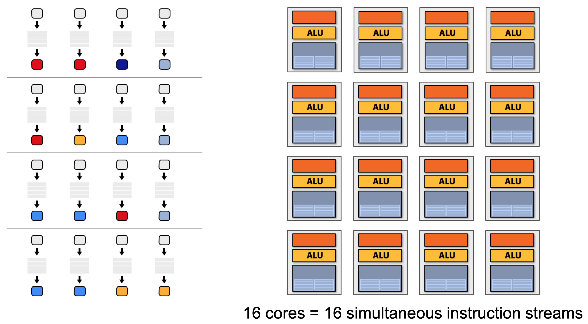

<!-- _class: lead -->
# A brief introduction to GPGPU
zhuyie
zhuyie@gmail.com

---
# Agenda
- A demo program
- What is GPU/GPGPU?
- GPGPU Programming
- The difference between CPU and GPU
- Closer look at real GPU designs

---
<!-- paginate: true -->
# Estimate pi using Monte Carlo
- A simple way to estimate the value of pi is from **the area ratio** between a unit quarter-circle and the enclosing unit square. 

---
# Estimate pi using Monte Carlo
- We can simply select a **large** number of **uniformly distributed** points within the square. The fraction of points **inside** to the **total** number of points is identical to the area ratio between the quarter-circle and the square.

- For each point, we determine if it is **in** the circle, x^2 + y^2 <= a^2.

---
# Estimate pi using Monte Carlo

---
# Estimate pi using Monte Carlo

---
# Estimate pi using Monte Carlo

---
# What is GPU?
- A [graphics processing unit (GPU)](https://en.wikipedia.org/wiki/Graphics_processing_unit) is a specialized electronic circuit designed to rapidly manipulate and alter memory to accelerate the creation of images in a frame buffer intended for output to a display device. 
- Modern GPUs are very efficient at manipulating computer graphics and image processing. Their **highly parallel structure** makes them more efficient than CPUs for algorithms that process large blocks of data in parallel. 
- The term was popularized by Nvidia in 1999, who marketed the GeForce 256 as "the world's first GPU".

---
# The Graphics Pipeline

---
# Vertex processing

---
# Primitive processing

---
# Rasterization

---
# Fragment processing

---
# Pixel operations

---
# Programmable Graphics Pipeline

---
# Shader Program Architecture

---
# Simple OpenGL Vertex Shader

---
# Simple OpenGL Fragment Shader

---
# What's in a GPU?

---
# GPU Computing?
- Beyond basic graphics
  - Collision detection
  - Fluid and cloth
  - Ray tracing
- Beyond graphics
  - Protein folding
  - Speech recognition
  - Fourier transforms

---
# GPGPU
- **G**eneral **P**urpose computation on **G**raphics **P**rocessing **U**nits.
- [Unified shader model](https://en.wikipedia.org/wiki/Unified_shader_model) refers to a form of hardware in a GPU where **all of the shader stages** in the rendering pipeline (vertex, geometry, pixel, etc.) **have the same capabilities**. They can all read textures and buffers, and they use instruction sets that are almost identical.
- They can do **generic computing** as well.

---
# GPU Computing APIs
- **CUDA** - a parallel computing platform and API model created by **Nvidia**. _Nvidia GPU only_.
- OpenGL/DirectX/Vulkan **Compute Shader**.
- **OpenCL** - a framework for writing programs that execute across heterogeneous platforms (CPUs, GPUs, DSPs, ...).
- **Metal** - a low-level, low-overhead hardware-accelerated 3D graphic and compute shader API created by **Apple**.

---
# GPGPU Programming
- OpenCL have a good abstraction layer.
- Use our estimate-pi program as an example.

---
# OpenCL Platform Model

---
# OpenCL Device Example
- ATI Radeon™ HD 5870 GPU

---
# OpenCL Device Example
- ATI Radeon™ HD 5870 GPU

---
# OpenCL Execution Model
- **Kernel:**
  - Basic unit of executable code that runs on OpenCL devices.
  - Data-parallel or task-parallel.
- **Host program:**
  - Executes on the host system.
  - Sends kernels to execute on OpenCL devices using command queue.

---
# Kernels – Define Work Load
- Define N-dimensional computation domain.
  - N = 1, 2, or 3.
  - Each element in the domain is called a **work-item**.
  - N-D domain (**global dimensions**) defines the total work-items that execute in parallel.
  - Each work-item executes the **same** kernel.
- 

---
# Kernels - Work-group
- Work-items are grouped into work-groups.
  - **Local dimensions** define the size of the workgroups.
  - Execute together on **same** compute unit.
  - Share **local memory** and **synchronization**.

---
# Kernels - Work-group Example

---
# OpenCL C Language
- The programming language that is used to write compute kernels is called **OpenCL C** and is based on C99, but adapted to fit the device model in OpenCL.

---
# OpenCL Memory Model

---
# OpenCL Memory Model
- **Global** – read and write by all workitems and work-groups.
- **Constant** – read-only by work-items; read and write by host.
- **Local** – used for data sharing; read/write by work-items in same work-group.
- **Private** – only accessible to one work-item.
- Memory management is **explicit**:
  - Must move data from host to global to local and back.

---
# Demo - Kernel Program

---
# Demo - Host Program

---
# Demo - Host Program

---
# Demo - Host Program

---
# Demo - Host Program

---
# Demo - Host Program

---
# Demo - Host Program

---
# Demo - Output

---
# Latency and Throughput
- **Latency** is a time delay between the moment something is initiated, and the moment one of its effects begins or becomes detectable.
- **Throughput** is the amount of work done in a given amount of time.
- **CPUs** are **low latency low throughput** processors.
- **GPUs** are **high latency high throughput** processors.

---
# Latency and Throughput
- CPUs are designed to **minimize latency**.
  - Example: Mouse or keyboard input.
- CPUs are designed to **maximize single thread performance**:
  - Large caches.
  - Superscalar (execute more than one instruction during a clock cycle).
  - Out-of-order execution.
  - Branch prediction.

---
# Latency and Throughput
- GPUs are designed for tasks that can **tolerate latency**.
  - Example: Graphics in a game (simplified scenario):
  
- GPUs are designed for tasks that need high throughput, i.e. processing **millions of** pixels in a single frame.

---
# CPU vs GPU Transistor Allocation
- GPUs can have more ALUs for the same sized chip and therefore run many more threads of computation.

- Modern GPUs run 10,000s of threads concurrently.

---
# CPU die
- Intel Skylake quad-core (14 nm, ~122.3 mm²)
 

---
# GPU die
- NVIDIA GeForce GTX 1080 (16 nm, ~314 mm²)
 

---
# Theoretical peak FLOPS
- Intel Core i7-6700 (Skylake quad-core)

- NVIDIA GeForce GTX 1080

---
# Managing Threads On A GPU
- CPU threads:
  - 10s of relatively **heavyweight** threads run on 10s of cores.
  - Thread programmed and created **explicitly**.
  - Thread have relatively **long** life-cycle.
  - Context switching is **costly**. 
- How do we:
  - Dispatch, schedule, and context switch 10,000s of threads?
  - Program 10,000s of threads?

---
# A diffuse reflectance shader

---
# Execute shader

---
# "CPU-style" cores

---
# Slimming down

---
# Two cores

---
# Four cores

---
# Sixteen cores

---
# Instruction stream sharing

---
# SIMD processing

---
# Modifying the shader

---
# Modifying the shader

---
# 128 fragments in parallel

---
# 128 [*] in parallel

---
# SIMD processing
- SIMD processing does not imply SIMD instructions.
  - Option 1: explicit vector instructions
    - x86 SSE, AVX
  - Option 2: scalar instructions, **implicit HW vectorization**
    - NVIDIA GeForce (SIMT **“warps”**), ATI Radeon architectures (**“wavefronts”**)
    - In practice: 32 to 64 fragments (threads) share an instruction stream.

---
# But what about branches?

---
# But what about branches?

---
# Stalls!
- Stalls occur when a core cannot run the next instruction:
  - There is a dependency on a previous operation.
  - The compute resources required by the instruction are not yet available.
- Texture access latency = 100’s to 1000’s of cycles.
- We’ve removed the fancy caches and logic that helps avoid stalls.

---
# Stalls!

---
# Hiding shader stalls

---
# Hiding shader stalls

---
# Hiding shader stalls

---
# Throughput!

---
# Fast context switching
- A large register file which can store large # of contexts.

- All "stalled" threads still resident in GPU.
- "zero-overhead" context switching.

---
# Example chip

---
# Summary: three key ideas
1. Use many **“slimmed down cores”** to run in parallel.
2. Pack cores **full of ALUs** (by sharing instruction stream across groups of fragments)
   - Option 1: Explicit SIMD vector instructions.
   - Option 2: Implicit sharing managed by hardware.
3. Avoid latency stalls by **interleaving execution** of many groups of fragments.
   - When one group stalls, work on another group.

---
# NVIDIA GP104 GPU
- Based on NVIDIA Pascal GPU architecture.
- Released on May 27th, 2016.
- The first graphics card to ship with the GP104 GPU is the GeForce GTX® 1080.
- https://international.download.nvidia.cn/geforce-com/international/pdfs/GeForce_GTX_1080_Whitepaper_FINAL.pdf

---
# NVIDIA GP104 GPU

---
# NVIDIA GP104 GPU
- **G**raphics **P**rocessor **C**lusters, **S**tream **M**ultiprocessor.
- 4 GPCs, 5 SMs per GPC.
- Each SM:
  - 128 CUDA cores
  - 256 KB of register file
  - 96 KB shared memory
- 128 x 20 = 2560 CUDA cores
- 256 KB x 20 = 5120 KB register file

---
# NVIDIA GP104 GPU

---
# NVIDIA GP104 GPU
- Each CUDA Core has a fully pipelined integer arithmetic logic unit (ALU) and floating point unit (FPU).

- LD/ST: supporting units load and store the data at each address to cache or DRAM.
- SFU: execute transcendental instructions such as sin, cosine,
reciprocal, and square root.

---
# NVIDIA GP104 GPU
- https://docs.nvidia.com/cuda/cuda-c-programming-guide/index.html#compute-capabilities
- Warp size: 32
- Maximum # of resident warps per SM: 64
- Maximum # of **resident** threads: 64 x 32 x 20 = 40960
- Maximum # of **executing** threads: 2560

---
# Back to demo program
- Why 16 threads gave us 9.87x speed up?

---
# Back to demo program
- Intel Core i9-9980HK: 8 cores, 16 threads
- Hyper-Threading
  - Each core contains two logical cores, each of which has its **own** processor architectural state.
  - The logical cores **share** the execution resources (eg. ALU).
  - When one thread stalled, switch to another one.
- The demo program is compute-intensive.

---
# Back to demo program
- Why v1 kernel so slow?

- 1 PRNG per GPU thread
  - v1: mt19937 (state: int[624], ~2500 bytes)
  - v2: tinymt32j (state: 4 int, 16 bytes)

---
# Back to demo program
- GPU Performance Counters (query by [GPA](https://gpuopen.com/gpuperfapi/)):

---
# Back to demo program
- Kernel private variables usually stored in registers.
- **Register spilling** when:
  - Hardware limit # registers per thread exceeded.
  - Arrays declared inside kernels (Registers aren’t indexable).
- It could hurt performance in two ways:
  - Increased memory traffic.
  - Increased instruction count.

---
<!-- _class: lead -->
# Thanks
