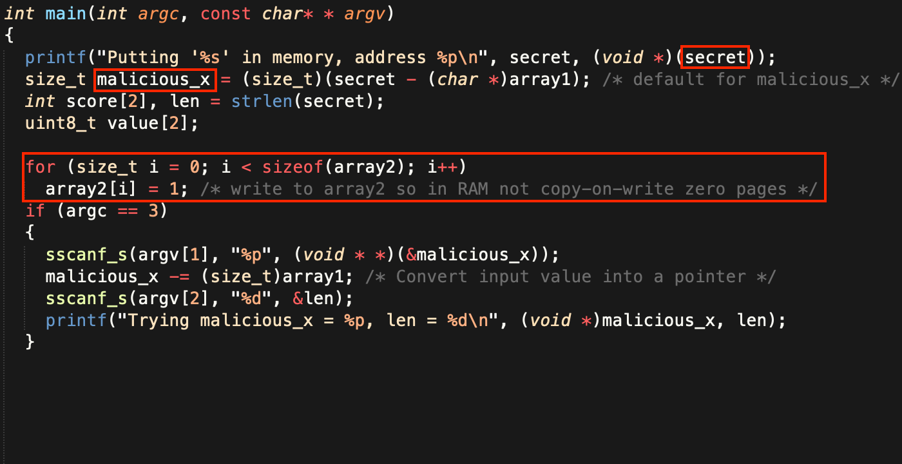
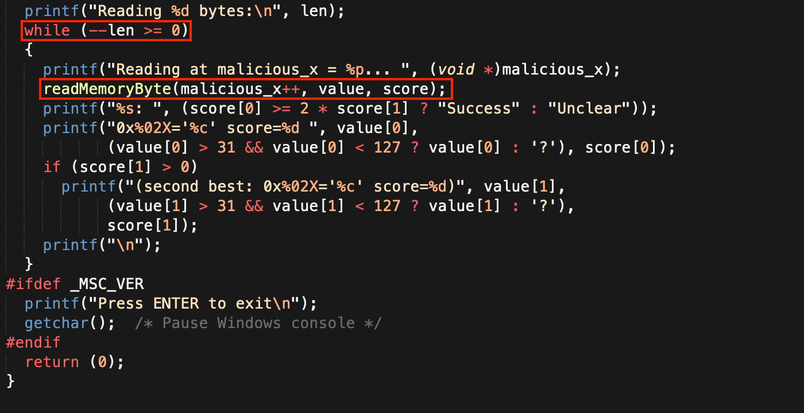
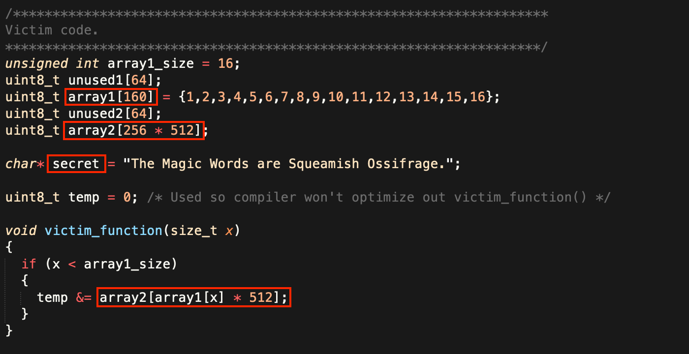
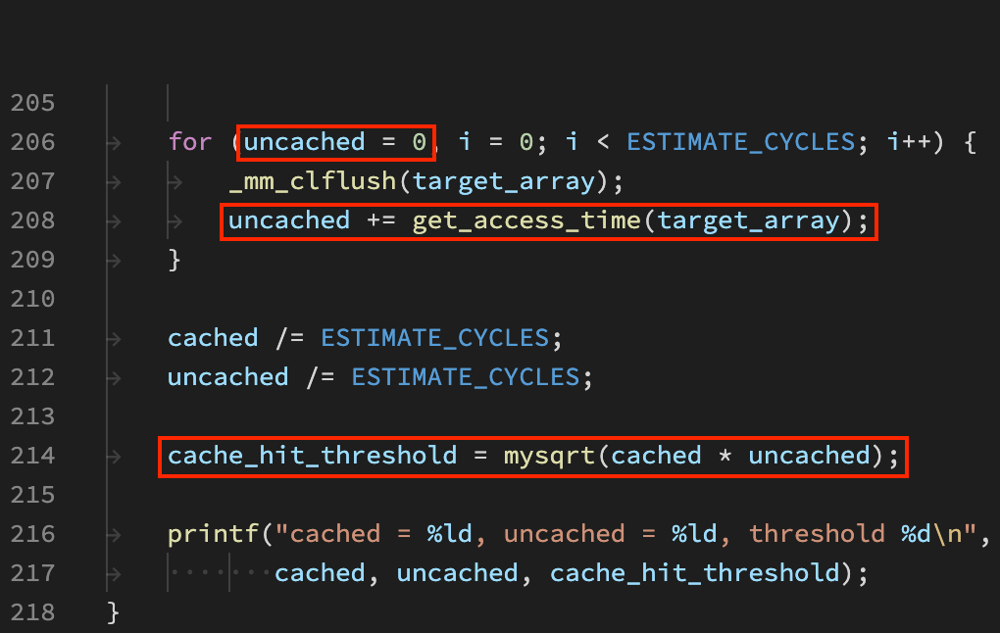

<!-- _class: lead -->
# Meltdown && Spectre
### 从硬件漏洞看现代CPU架构
zhuyie
zhuyie@gmail.com

---
<!-- paginate: true -->
# Agenda
- todo

---
# Spectre V1 PoC
* [Spectre Paper](https://spectreattack.com/spectre.pdf)
* 
* The code fragment begins with a bounds check on x which
is essential for security. In particular, this check **prevents** the
processor from reading sensitive memory **outside of array1**.
* What if we supplying x = (address of a **secret byte** to read) − (base address of array1) and a **branch misprediction** occurred?
* https://github.com/Eugnis/spectre-attack

---
# Spectre V1 PoC

---
# Spectre V1 PoC

---
# Spectre V1 PoC

---
# Spectre V1 PoC

---
# Spectre V1 PoC

---
# Spectre V1 PoC

---
# Spectre V1 PoC

---
# Spectre V1 PoC

---
# Spectre V1 PoC

---
# Spectre V1 wrap-up
*  Key idea: **mistrains** the CPU's branch predictor, causing the CPU to temporarily **violate program semantics** by executing code that would not have been executed otherwise.
* The unoptimized implementation of the above PoC can read around **10 KB/s** on an i7-4650U with a low (< 0.01%) error rate.
* Can be **remotely exploited** by code hosted on web pages, for example interpreted languages like **JavaScript**, which run locally using a **web browser**. The scripted malware would then have access to all the memory mapped to the address space of the running browser.

---
# Meltdown PoC
* [Meltdown Paper](https://meltdownattack.com/meltdown.pdf)
* 
* Line 4 reads from a kernel address, the load **succeed internally**, but will raise an exception when this instruction **retired**.
* Line 5-7 might be executed **before** line 4 retired due to OoO.
* When line 4 is retired, the **exception** is registered, and the **pipeline** is flushed to eliminate all results of subsequent instructions.

---
# Meltdown PoC
* Meltdown consists of 3 steps:
  1. The content of an attacker-chosen memory location, which is inaccessible to the attacker, is **loaded** into a register.
  2. A transient instruction **accesses** a cache line based on the secret content of the register.
  3. The attacker uses **Flush+Reload** to determine the accessed cache line and hence the secret stored at the chosen memory location.
* https://github.com/paboldin/meltdown-exploit

---
# Meltdown PoC
* Dump `linux_proc_banner` from a user-mode application.
* 
* 

---
# Meltdown PoC

---
# Meltdown PoC

---
# Meltdown PoC

---
# Meltdown PoC

---
# Meltdown PoC

---
# Meltdown Poc

---
# Meltdown PoC

---
# Meltdown PoC
 

---
# Meltdown PoC

---
# Meltdown PoC

---
# Meltdown wrap-up

---
# Mitigations
* [Spectre mitigations in MSVC](https://devblogs.microsoft.com/cppblog/spectre-mitigations-in-msvc/)
* [Understanding the performance impact of Spectre and Meltdown mitigations on Windows Systems](https://www.microsoft.com/security/blog/2018/01/09/understanding-the-performance-impact-of-spectre-and-meltdown-mitigations-on-windows-systems/)
* Spectre V1 (Bounds Check Bypass)
  - **Compiler** change; Recompiled **system binaries** distributed by Windows Updates.
  - Edge & IE11 **hardened** to prevent exploit from JavaScript.
* Meltdown (Rogue Data Cache Load)
  - **Isolate** kernel and user mode **page tables**.

---
# Mitigations - Performance

---
# Mitigations - MSVC /Qspectre
* For Intel and similar processors the **LFENCE** instruction will stop younger instructions from executing, even speculatively, before older instructions have retired. 
* An LFENCE instruction inserted **after a bounds check** will **prevent** younger operations from executing before the bound check retires. Therefore it can act as a **speculation barrier**.
* The MSVC compiler has been updated with support for the /Qspectre switch which will **automatically** insert one of these **speculation barriers** when the compiler **detects** instances of variant 1. 

---
# Migigations - MSVC /Qspectre

[link](https://www.felixcloutier.com/x86/lfence)

---
# Mitigations - MSVC /Qspectre

---
# Mitigations - MSVC /Qspectre

---
# Mitigations - MSVC /Qspectre

---
# Mitigations - MSVC /Qspectre

---
# Mitigations - KPTI
* [The current state of kernel page-table isolation](https://lwn.net/Articles/741878/)
* In old kernels, each process has a **single** page global directory (PGD). one of the first steps taken in the KPTI is to create a **second** PGD.
* The original remains in use when the kernel is running; it maps the full address space. The second is made active when the process is running in **user space**. It points to the same directory hierarchy for pages belonging to the process itself, but the portion describing kernel space is **mostly absent**.
* **Switch** page table when enter/exit kernel space.

---
# Mitigations - KPTI
* KPTI will affect performance for anything that does **system calls** or **interrupts**. Just the new instructions (CR3 manipulation) add a few hundred cycles to a syscall or interrupt.
* Old CPUs (without PCIDs) require a **TLB flush** when switching the page table, which hurt performance badly.
* For database engine PostgreSQL the impact on read-only tests on an Intel Skylake processor was 7–17% (or 16–23% without PCIDs). [link](https://www.postgresql.org/message-id/20180102222354.qikjmf7dvnjgbkxe%40alap3.anarazel.de)
* Intel **hardware fixes** to Meltdown from Cascade Lake. [link](https://www.extremetech.com/computing/275776-intel-discusses-cascade-lakes-improvements-hardware-mitigations-for-meltdown-spectre)

---
# References
- https://meltdownattack.com/
- https://newsroom.intel.com/wp-content/uploads/sites/11/2018/01/Intel-Analysis-of-Speculative-Execution-Side-Channels.pdf
- https://www.amd.com/system/files/documents/security-whitepaper.pdf
- https://developer.arm.com/-/media/Files/pdf/Cache_Speculation_Side-channels.pdf

---
# References
- https://www.moesif.com/blog/technical/cpu-arch/What-Is-The-Actual-Vulnerability-Behind-Meltdown/
- https://llvm.org/docs/SpeculativeLoadHardening.html
- https://www.raspberrypi.com/news/why-raspberry-pi-isnt-vulnerable-to-spectre-or-meltdown/
- https://hadibrais.wordpress.com/2018/05/14/the-significance-of-the-x86-lfence-instruction/
