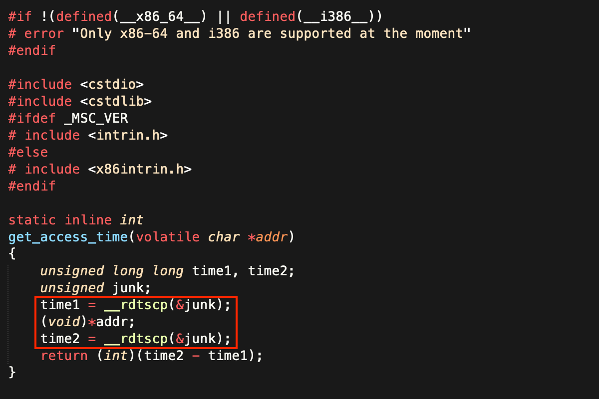
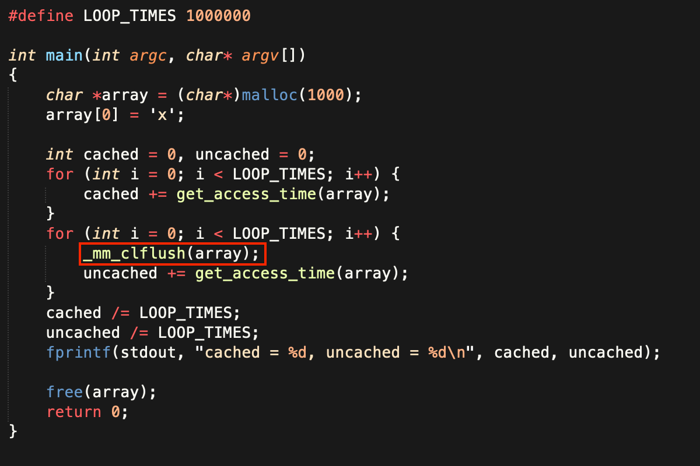
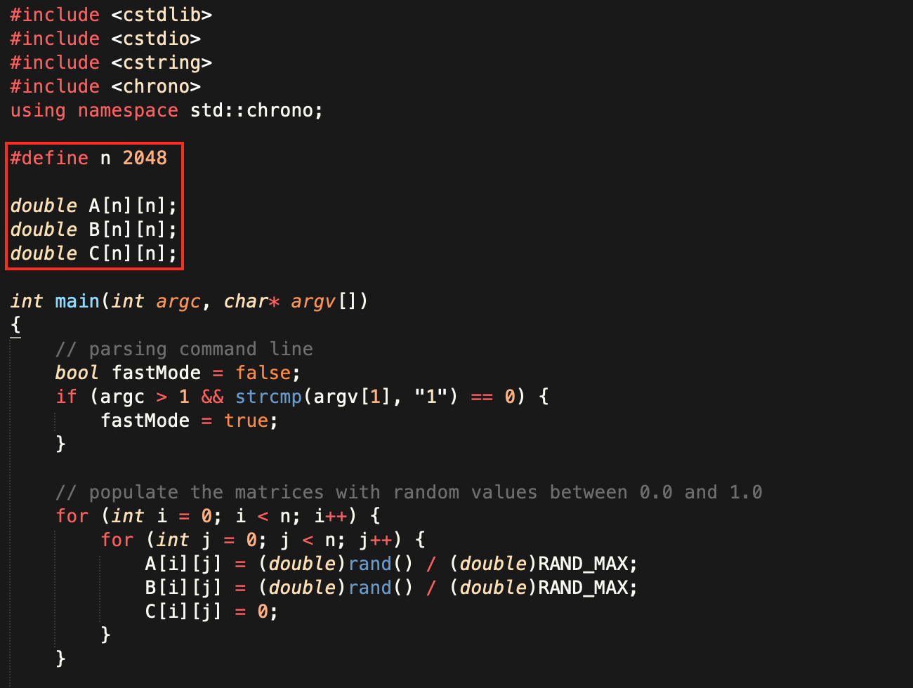
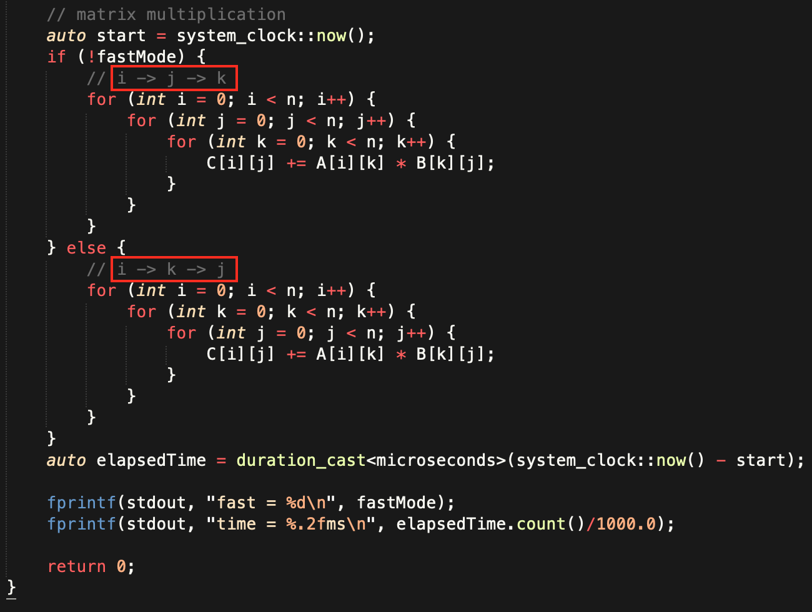
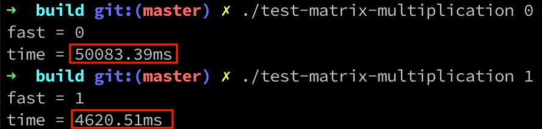
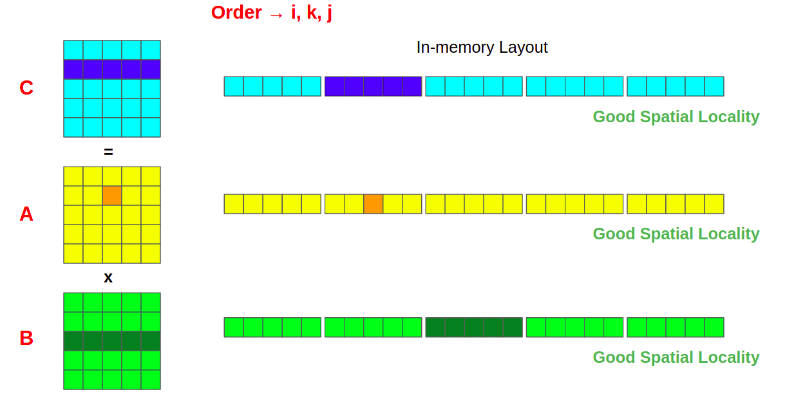
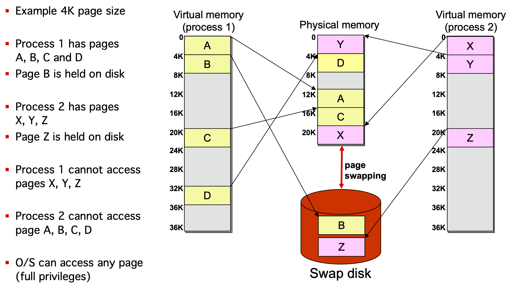
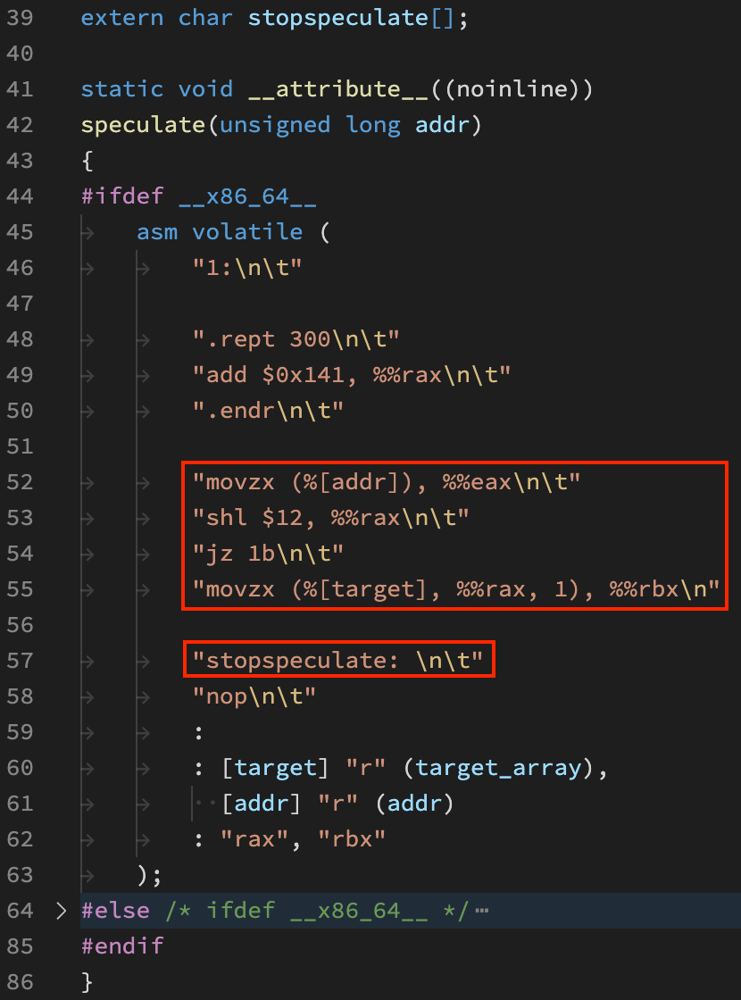

<!-- _class: lead -->
# Meltdown && Spectre
### 从硬件漏洞看现代CPU架构
zhuyie
zhuyie@gmail.com

---
<!-- paginate: true -->
# Agenda
- Vulnerabilities
- A brief introduction of CPU architecture
- Spectre V1 PoC
- Meltdown PoC
- Mitigations

---
# Catastrophic Vulnerabilities

 

[1](https://arstechnica.com/gadgets/2018/01/meltdown-and-spectre-every-modern-processor-has-unfixable-security-flaws/) [2](https://www.theregister.com/2018/01/02/intel_cpu_design_flaw/)

---
# Intel's Response

https://www.intel.com/content/www/us/en/architecture-and-technology/side-channel-variants-1-2-3.html

---
# Meltdown
* Meltdown exploits **side effects** of **out-of-order** execution on modern processors to **read arbitrary kernel-memory** locations including personal data and passwords.
* The attack is independent of the operating system, and it does not rely on any software vulnerabilities.
* Meltdown breaks all **security guarantees** provided by **address space isolation** as well as paravirtualized environments.

---
# Spectre
* Spectre is a class of security vulnerabilities that affects modern microprocessors that perform **branch prediction**.
* Spectre attacks involve inducing a victim to **speculatively** perform operations that **would not occur** during correct program execution and which **leak** the victim’s confidential information via a **side channel** to the adversary.
* JIT engines used for **JavaScript** were found to be vulnerable. A website can read data stored in the browser for another website, or the browser's memory itself.

---
# Variants

---
# What is a side channel?
From Wikipedia:

“… a side-channel attack is any attack based on **information** gained from the **physical implementation** of a cryptosystem, rather than brute force or theoretical weaknesses in the **algorithms**. For example, **timing information**, power consumption, electromagnetic leaks or even sound can provide an extra source of information, which can be exploited to break the system.”

---
# CPU die
- Intel Skylake quad-core (14 nm, ~122.3 mm²)
 

---
# CPU core block diagram
 

---
# Caches
* Why do CPUs need Caches?
  - [The Gap between Processor and Memory Speeds](http://gec.di.uminho.pt/discip/minf/ac0102/1000gap_proc-mem_speed.pdf)
* How does CPU Cache work?
  - **SRAM** vs. DRAM
  - 1~10 ns vs. 100+ ns
  - 32KB~8MB vs. 32+ GB
  - Data is transferred between memory and cache in blocks of fixed size, called **cache lines**.
  - Temporal **locality** and Spatial locality.

---
# Cache Timing
 

---
# Performance Impact of Cache
[The impact of cache locality on performance in C through matrix multiplication](https://levelup.gitconnected.com/c-programming-hacks-4-matrix-multiplication-are-we-doing-it-right-21a9f1cbf53)
  

---
# Performance Impact of Cache

---
# Performance Impact of Cache

---
# System Protection
* User programs typically not trusted:
  * May use unfair amount of resources
  * May maliciously cause other programs or OS to fail
* System provides two CPU modes:
  * **User mode**: Some access to hardware resources restricted
  * **Kernel mode**: Full access to hardware resources

---
# How CPU Modes are implemented
* A modern CPU typical provides different **protection rings**, which represent different **privilege levels**.
* E.g., an x86 CPU usually provides 4 rings, and a Windows OS uses **Ring 0** for the kernel mode and **Ring 3** for the user mode.

---
# Kernel Mode vs. User Mode
* A **fault** in the user space (e.g., divided by zero, invalid access, null pointer dereference) can be captured by the Kernel (without crashing the whole system).
* **Privileged instructions** can only be issued in the kernel mode.
  - E.g., disk I/O.
  - – In x86, an attempt to execute them from ring 3 leads to GP (General Protection) exceptions.
* The **kernel memory space** can only be accessed in the kernel mode.
  - E.g., the list of processes for scheduling.

---
# System Calls
* If I/O operations rely on privileged instructions, how does a **user program** read/write?
* **System calls**.
* When a system call is issued, the process goes **from** user mode (Ring 3) **to** kernel mode (Ring 0).
* **printf** call (Ring 3) => **write** system call => Kernel code (Ring 0).

---
# System Calls

---
# Virtual Memory
* Motivation:
  * Processes would like their memory to be **protected** from access and modification by other processes.
  * The operating system needs to be **protected** from applications.
  * By using **swap file** the operating system can use more RAM than it actually has.
  * **Programmers** would like each process see its own, full, address space.

---
# Virtual Memory
* Basic idea:
  * Each process has its own **Virtual Address Space**, divided into fixed-sized **pages**.
  * Virtual pages that are in use get **mapped** to pages of physical memory (called page frames).
    * Virtual memory: pages
    * Physical memory: frames
  * Virtual pages not recently used may be stored on **disk**.

---
# Virtual and Physical Memory

---
# Sharing Memory using Virtual Aliases

---
# Virtual Address Space

In 32-bit Windows, the total available virtual address space is 2^32 bytes (4 GB). Usually the lower 2 GB are used for user space, and the upper 2 GB are used for system space.

---
# How to Finding the Physical Page
* OS uses some data structures that maps virtual pages to physical page frames: **Page Table** (PT).
* The OS **updates** the PT with a new mapping whenever it allocates a page frame to a virtual page.
* PT is accessed on a memory request to translate virtual to physical address → **inefficient!**
  * Solution: **cache** translations (TLB)
* One PT per **process**.

---
# Page Tables and Address Translation

---
# x86 32-Bit PTE

bit 2: if 0, user-mode accesses are not allowed to the 4KB page referenced by this entry.

---
# Making Page Tables space-efficient
* The number of entries in the table is the number of virtual pages:
  * e.g., 4KB pages
  * 2^20 entries for a 32b address space → need **4MB/process**.
  * 2^52 entries for a 64b address space → petabytes per process!
*  The virtual address space of each process is **sparse** → only a fraction of all virtual addresses actually used.
* Solutions:
  * multi-level page table (x86)
  * inverted page table (PowerPC, UltraSPARC)

---
# x86 Two-level page table

---
# Fast address translation: TLB

---
# Scalar Processor
* The simplest sort of modern processor executes **one instruction per cycle** (CPI=1); we call this a scalar processor.
 
* Examples of scalar processors include the Intel 486 and the ARM1176 core used in Raspberry Pi Zero.

---
# Superscalar Processor
* Remember the execute stage in particular is really made up of **several** different groups of logic (several sets of gates).

* We can duplicating HW for IF/ID/WB, then we can **simultaneously** dispatching multiple instructions to different execution units.
  (CPI=3 ?)

---
# Spectre V1 PoC
* [Spectre Paper](https://spectreattack.com/spectre.pdf)
* 
* The code fragment begins with a bounds check on x which
is essential for security. In particular, this check **prevents** the
processor from reading sensitive memory **outside of array1**.
* What if we supplying x = (address of a **secret byte** to read) − (base address of array1) and a **branch misprediction** occurred?
* https://github.com/Eugnis/spectre-attack

---
# Spectre V1 PoC

---
# Spectre V1 PoC

---
# Spectre V1 PoC

---
# Spectre V1 PoC

---
# Spectre V1 PoC

---
# Spectre V1 PoC

---
# Spectre V1 PoC

---
# Spectre V1 PoC

---
# Spectre V1 PoC

---
# Spectre V1 wrap-up
*  Key ideas: **mistrains** the CPU's branch predictor, causing the CPU to temporarily **violate program semantics** by executing code that would not have been executed otherwise.
* The unoptimized implementation of the above PoC can read around **10 KB/s** on an i7-4650U with a low (< 0.01%) error rate.
* Can be **remotely exploited** by code hosted on web pages, for example interpreted languages like **JavaScript**, which run locally using a **web browser**. The scripted malware would then have access to all the memory mapped to the address space of the running browser.

---
# Meltdown PoC
* [Meltdown Paper](https://meltdownattack.com/meltdown.pdf)
* 
* Line 4 reads from a kernel address, the load **succeed internally**, but will raise an exception when this instruction **retired**.
* Line 5-7 might be executed **before** line 4 retired due to OoO.
* When line 4 is retired, the **exception** is registered, and the **pipeline** is flushed to eliminate all results of subsequent instructions.

---
# Meltdown PoC
* Meltdown consists of 3 steps:
  1. The content of an attacker-chosen memory location, which is inaccessible to the attacker, is **loaded** into a register.
  2. A transient instruction **accesses** a cache line based on the secret content of the register.
  3. The attacker uses **Flush+Reload** to determine the accessed cache line and hence the secret stored at the chosen memory location.
* https://github.com/paboldin/meltdown-exploit

---
# Meltdown PoC
* Dump `linux_proc_banner` from a user-mode application.
* 
* 

---
# Meltdown PoC

---
# Meltdown PoC

---
# Meltdown PoC

---
# Meltdown PoC

---
# Meltdown PoC

---
# Meltdown PoC

---
# Meltdown PoC

---
# Meltdown PoC
 

---
# Meltdown PoC

---
# Meltdown PoC

---
# Meltdown wrap-up
* Key ideas: 
  1. Each process has a single full page table. 
  2. Vulnerable out-of-order CPUs allow an unprivileged process to load data from a privileged address.
  3. There is a race condition between raising the exception and a cache attack.
* The PoC can read **582 KB/s** with a low error rate on i7-8700K.
* Meltdown **breaks** all security guarantees provided by address space isolation as well as paravirtualized environments.

---
# Mitigations
* [Spectre mitigations in MSVC](https://devblogs.microsoft.com/cppblog/spectre-mitigations-in-msvc/)
* [Understanding the performance impact of Spectre and Meltdown mitigations on Windows Systems](https://www.microsoft.com/security/blog/2018/01/09/understanding-the-performance-impact-of-spectre-and-meltdown-mitigations-on-windows-systems/)
* Spectre V1 (Bounds Check Bypass)
  - **Compiler** change; Recompiled **system binaries** distributed by Windows Updates.
  - Edge & IE11 **hardened** to prevent exploit from JavaScript.
* Meltdown (Rogue Data Cache Load)
  - **Isolate** kernel and user mode **page tables**.

---
# Mitigations - Performance

---
# Mitigations - MSVC /Qspectre
* For Intel and similar processors the **LFENCE** instruction will stop younger instructions from executing, even speculatively, before older instructions have retired. 
* An LFENCE instruction inserted **after a bounds check** will **prevent** younger operations from executing before the bound check retires. Therefore it can act as a **speculation barrier**.
* The MSVC compiler has been updated with support for the /Qspectre switch which will **automatically** insert one of these **speculation barriers** when the compiler **detects** instances of variant 1. 

---
# Migigations - MSVC /Qspectre

[link](https://www.felixcloutier.com/x86/lfence)

---
# Mitigations - MSVC /Qspectre

---
# Mitigations - MSVC /Qspectre

---
# Mitigations - MSVC /Qspectre

---
# Mitigations - MSVC /Qspectre

---
# Mitigations - KPTI
* [The current state of kernel page-table isolation](https://lwn.net/Articles/741878/)
* In old kernels, each process has a **single** page global directory (PGD). one of the first steps taken in the KPTI is to create a **second** PGD.
* The original remains in use when the kernel is running; it maps the full address space. The second is made active when the process is running in **user space**. It points to the same directory hierarchy for pages belonging to the process itself, but the portion describing kernel space is **mostly absent**.
* **Switch** page table when enter/exit kernel space.

---
# Mitigations - KPTI
* KPTI will affect performance for anything that does **system calls** or **interrupts**. Just the new instructions (CR3 manipulation) add a few hundred cycles to a syscall or interrupt.
* Old CPUs (without PCIDs) require a **TLB flush** when switching the page table, which hurt performance badly.
* For database engine PostgreSQL the impact on read-only tests on an Intel Skylake processor was 7–17% (or 16–23% without PCIDs). [link](https://www.postgresql.org/message-id/20180102222354.qikjmf7dvnjgbkxe%40alap3.anarazel.de)
* Intel **hardware fixes** to Meltdown from Cascade Lake. [link](https://www.extremetech.com/computing/275776-intel-discusses-cascade-lakes-improvements-hardware-mitigations-for-meltdown-spectre)

---
# References
- https://meltdownattack.com/
- https://newsroom.intel.com/wp-content/uploads/sites/11/2018/01/Intel-Analysis-of-Speculative-Execution-Side-Channels.pdf
- https://www.amd.com/system/files/documents/security-whitepaper.pdf
- https://developer.arm.com/-/media/Files/pdf/Cache_Speculation_Side-channels.pdf

---
# References
- https://www.moesif.com/blog/technical/cpu-arch/What-Is-The-Actual-Vulnerability-Behind-Meltdown/
- https://llvm.org/docs/SpeculativeLoadHardening.html
- https://www.raspberrypi.com/news/why-raspberry-pi-isnt-vulnerable-to-spectre-or-meltdown/
- https://hadibrais.wordpress.com/2018/05/14/the-significance-of-the-x86-lfence-instruction/
- https://www.lighterra.com/papers/modernmicroprocessors/
- http://www.inf.ed.ac.uk/teaching/courses/car/Notes/2017-18/lecture08-virtual_memory.pdf
