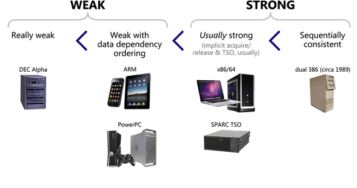

<style>
h1 {
  font-size: 1.6em;
  color: #1B558E;
}
section {
  font-family: 'Avenir Next', 'Avenir', 'Trebuchet MS', 'Segoe UI', sans-serif;
  padding: 50px;
}
</style>

<!-- _class: lead -->
# Memory Reordering
zhuyie
zhuyie@gmail.com

---
<!-- paginate: true -->
# Agenda
- Background
- Example 1: Read two 0s
- Example 2: Peterson lock
- Conclusion

---
<!-- _class: lead -->
# Background

---
# What is memory reordering?
* Memory reordering refers to the reordering of instructions when the **execution order** of the instructions is **inconsistent** with the order written in the code (**source code order**). 
* It usually occurs in the following two procedures:
  - Compiler reordering (Compile time)
  - CPU reordering (Run time)
* Motivation: to improve the **speed** of running code.

---
# Basic principle
* Memory reordering **shall not modify the behavior of a single-threaded program**.
* Therefore, memory reordering does not affect single-threaded programs.
* However, if it is **multi-threaded**, these optimizations can bring problems to the semantics of the program.

---
# Different kinds of orderings


---
# Compiler reordering
* The compiler may adopt a series of compilation **optimizations** during the compilation process.
  * register allocation
  * loop-invariant code motion
  * dead store elimination
  * ...
* The **program order** (specified in the machine code) may differ from the **source code order**.

---
# Compiler reordering
* What is the output?

* From the single-threaded perspective, the store-to-A and store-to-B is **irrelevant**, so the compiler is free to change the ordering.
* How about multi-threaded execution?


---
# Compiler reordering
* What is the output?

* But now suppose there’s another thread running in **parallel** with our loop, and it performs a single write to X (X = 0).
  * The first program can print strings like 11101111...
  * And the second program will print strings like 11100000...

---
# Compiler barrier
* The minimalist approach to preventing compiler reordering is by using a special directive known as a **compiler barrier**.

* Just a directive, no machine code will be generated.
* Every function containing a compiler barrier must act as a compiler barrier itself, even when the function is inlined.

---
# The volatile keyword
* Another way to implement the compiler barrier is by using the **volatile** keyword in the C/C++ language.

* A volatile variable can no longer be cached by registers.
* Not recommended for Linux kernels.

---
# A multi-core shared memory computer


---
# Coherence
* Consider this example: if both (1) and (2) starts to run at the same time, what is the output of (3) and (4)?

* The single main memory guarantees that there will always be a **“winner”**: a single last write to each variable. 
* We call this guarantee **coherence**, and it says that all writes to the **same location** are seen in the **same order** by every thread.
* It doesn’t prescribe the actual order.

---
# Consistency
* How about the ordering of operations to **multiple locations**?
* A **consistency model** defines the **allowed** behavior of loads and stores to different addresses in a parallel system. 
* For example, a consistency model can define that a process is not allowed to issue an operation until all previously issued operations are completed. Different consistency models enforce different conditions.

---
# Memory operation ordering
* A program defines a sequence of loads and stores.
  * the **"program order"**
* Four types of memory operation orderings:
  * W→R: write to X must **commit** before subsequent read from Y
  * R→R: read from X must commit before subsequent read from Y
  * R→W: read to X must commit before subsequent write to Y
  * W→W: write to X must commit before subsequent write to Y

---
# Multi-threaded execution
* Consider this example: (Initially A=B=0)

* Possible orders:
  * 1→2→3→4: prints "01"
  * 3→4→1→2: prints "01"
  * 1→3→2→4: prints "11"
  * and a few others that also prints "11"

---
# What should programmers expect
* **Sequential Consistency**
  * Lamport 1976 (Turing Award 2013)
  * Each thread’s operations happen in **program order**.
  * All operations executed in **some** sequential order.
* A sequentially consistent memory system maintains all four memory operation orderings (W→R, R→R, R→W, W→W)

---
# Sequential consistency (switch metaphor)

* All processors issue loads and stores in program order.
* Memory chooses a processor, performs a memory operation to completion, then chooses another processor, …
* The problem with this model is that it’s terribly **slow**.

---
# Things that shouldn’t happen
* Can this program prints **"00"**?

  * For line (2) to print "0", (2) should happen before (3)
  * For line (4) to print "0", (4) should happen before (1)
* Contradiction:
  * (1) -> (2)
  * (2) -> (3)
  * (3) -> (4) **=>** (1) -> (4)

---
# A simple computer cache structure


---
# Cache-coherency protocols
* Memory variables may have **local copy** in each CPU's cache.
* Clearly, much care must be taken to ensure that all CPUs maintain a **coherent** view of the data.
* Cache-coherency **protocols** manage cache-line states so as to prevent inconsistent or lost data.
* The most common used protocol: **MESI**

---
# MESI cache-coherence protocol
* MESI stands for **“modified”**, **“exclusive”**, **“shared”**, and **“invalid”**, the four **states** a given cache line can take on using this protocol.
* The protocol provides **messages** that coordinate the transitions of cache line states:
  - Read, Read-Response, Invalidate, Invalidate-Acknowledge, Read-Invalidate, Writeback
* Each cache **snooping** the bus, read & process the messages.
* In another word, a **message-based state machine**.

---
# Stores result in unnecessary stalls
* Sometimes, the cache's performance for the first write to a given cacheline is quite **poor**. For example, a write by CPU 0 to a cacheline held in CPU 1’s cache:


---
# Stores result in unnecessary stalls
* From CPU 0's perspective, the waiting is unnecessary if **later read can get the newly written value**.
* The CPU will usually use **store buffer** to resolve this issue:


---
# Store buffers change memory behavior
* ```A = 1``` can simply record in store buffer and continue executing.
* ```r1 = B``` may complete very fast.
* The write to ```A``` then seen by other CPUs.
* Globally it looks like: ```r1 = B``` move ahead of ```A = 1```.
* We need a **weaker** memory model.

---
# Total Store Ordering (TSO)
* Processor P can read B **before** its write to A is **seen** by all processors.
* Reads by other processors cannot return new value of A until the write to A is observed by all processors.
* In TSO, only **W→R order is relaxed**. The W→W constraint still exists. Writes by the same thread are not reordered (they occur in program order)
* **x86** uses an incompletely specified form of TSO.

---
# Total Store Ordering (TSO)
* What is the output? (Initially A = B = 0)

* If there was a simultaneous store-load **reorder**, the program may prints "00".

---
# Memory barrier
* The CPUs have no idea which variables are related, let alone how they might be related. Therefore, the hardware designers provide **memory-barrier instructions** to allow the software to **tell** the CPU about such relations.
* The memory barrier can cause the CPU to **flush** its store buffer. (simply stall until the store buffer was empty before proceeding)
* After insert some memory barrier instructions, the program works like in **SC**:


---
# Memory barrier
* A hardware barrier **also** act as a compiler barrier.
* x86 provides memory barriers in the form of fence instructions:


---
# Partial Store Ordering (PSO)
* Four types of memory operation orderings:

* What is the output? (Initially A = flag = 0)


---
# Weak vs. Strong Memory Models


---
# Coherence vs. Consistency
* **Memory coherence** defines requirements for the observed behavior of reads and writes to the **same** memory location.
  * All processors must agree on the order of reads/writes to X.
* **Memory consistency** defines the behavior of reads and writes
 to **different** locations (as observed by other processors).
  * Coherence only guarantees that writes to address X **will** eventually propagate to other processors.
  * Consistency deals with **when** writes to X propagate to other processors, relative to reads and writes to other addresses.

---
<!-- _class: lead -->
# Example 1: Read two 0s

---
# x86 store-load reorder
* x86 uses an incompletely specified form of TSO.
* In TSO, the **W→R order is relaxed**.
* Let's test this example on x86:


---
# SOME_BARRIER() and globals
 

---
# main(...)


---
# main(...) cont.


---
# thread1Func(...)


---
# thread2Func(...)


---
# BARRIER TYPE = 0


---
# BARRIER TYPE = 0


---
# BARRIER TYPE = 1


---
# BARRIER TYPE = 1


---
# BARRIER TYPE = 2


---
# BARRIER TYPE = 2


---
<!-- _class: lead -->
# Example 2: Peterson lock

---
# A naïve critical section implemetation
* To understand how hardware memory reordering can cause real-world bugs, let’s take a look at a C++ implementation of Peterson’s algorithm for two threads.
* [Peterson's algorithm](https://en.wikipedia.org/wiki/Peterson%27s_algorithm) is a concurrent programming algorithm for **mutual exclusion** that allows two or more processes to share a single-use resource without conflict, using **only** shared memory for communication. It was formulated by Gary L. Peterson in 1981.

---
# class Peterson


---
# lock(...)


---
# unlock(...)


---
# main(...)


---
# work(...)


---
# Output


---
# BARRIER TYPE = 0


---
# BARRIER TYPE = 2


---
# Conclusion
* There are only [two hard things](https://martinfowler.com/bliki/TwoHardThings.html) in computer science: cache invalidation, naming things.
* Maybe the third hardest thing is: **seeing things in order**.
* Multiprocessors reorder memory operations in **unintuitive** and strange ways.
* This behavior is required for **performance**.
* Carefully think through which portion of code will **run in parallel**.
* **Synchronization** to the rescue.

---
# References
- https://en.wikipedia.org/wiki/Consistency_model
- https://preshing.com/20120930/weak-vs-strong-memory-models/
- https://preshing.com/20120515/memory-reordering-caught-in-the-act/
- https://coffeebeforearch.github.io/2020/11/29/hardware-memory-ordering.html
- https://www.cs.utexas.edu/~bornholt/post/memory-models.html
