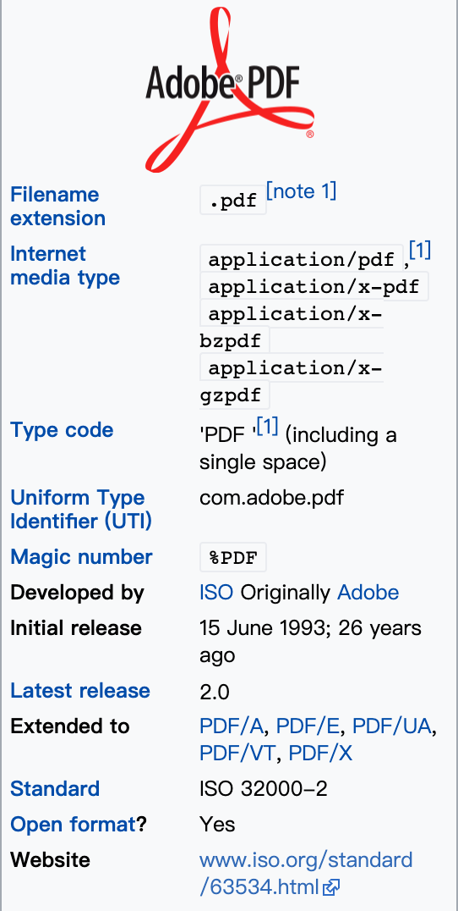
<!-- _class: lead -->
# Inside PDF

zhuyie
zhuyie@gmail.com

---
# Agenda
* Introduction
* File Structure
* Objects
* Document Structure
* Text Basics
* Glyph Selection
* Unicode Mapping

---
<!-- paginate: true -->
<!-- header: Ⅰ. Introduction -->
# Introduction
* The Portable Document Format (**PDF**) is a file format developed by **Adobe** in the 1990s to present documents, including text formatting and images, in a manner **independent** of application software, hardware, and operating systems.
* Based on the **PostScript** language.
* In the early years PDF was popular mainly in **desktop publishing** workflows, and competed with a variety of formats such as **DjVu**, Envoy, Common Ground Digital Paper, Farallon Replica.

---
# PostScript
* Researchers at Xerox PARC had developed the first **laser printer** and had recognized the **need** for a standard means of **defining page images**.
* John Warnock and Chuck Geschke founded **Adobe Systems** in 1982. They created **PostScript** in 1984. At about this time they were visited by **Steve Jobs**, who urged them to adapt PostScript to be used as the language for driving laser printers.
* In March 1985, the **Apple LaserWriter** was the first printer to ship with PostScript, sparking the desktop publishing (DTP) revolution in the mid-1980s.

---
# "Hello world!" in PostScript
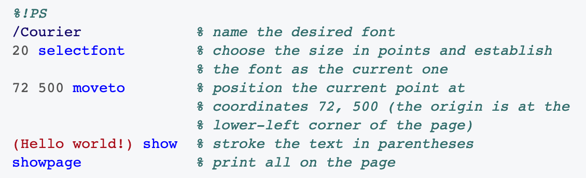

---
# DjVu
* DjVu (/ˌdeɪʒɑːˈvuː/) is a computer file format designed primarily to store **scanned documents**, especially those containing a combination of text, line drawings, indexed color images, and photographs.
* DjVu has been promoted as providing **smaller** files than PDF for most scanned documents.
* The DjVu technology was originally developed by **Yann LeCun**, Léon Bottou, Patrick Haffner, and Paul G. Howard at AT&T Labs from 1996 to 2001.

---
<!-- header: Ⅱ. File Structure -->
# File Structure
* A PDF file is a 7-bit **ASCII** file, except for certain elements that may have **binary content**.
* A PDF contains 4 sections:
  - **Header**, defines the version of PDF specification.
  - **Body**, the actual content that will be displayed.
  - **Cross-reference table**, a table for PDF viewers to quickly access different objects.
  - **Trailer**, defines other meta info of a PDF file.

---
# A blank PDF
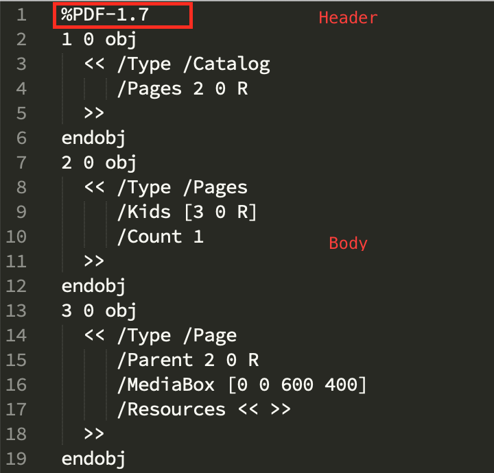 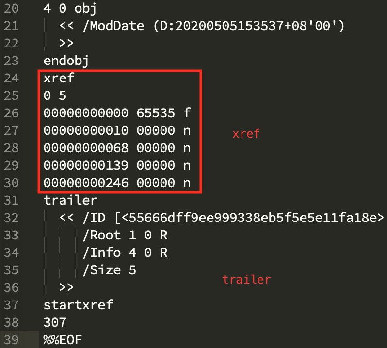

---
<!-- header: Ⅲ. Objects -->
# Objects
  - Boolean values
  - Integer and real numbers
  - Strings
  - Names
  - Arrays
  - Dictionaries
  - Streams
  - Null
  - Indirect Objects

---
# Simple Objects
* Boolean: ``true false``
* Numbers
  - Integer: ``123 43445 +17 −98 0``
  - Real: ``34.5 −3.62 +123.6 4. −.002 0.0``
* Strings
  - As a sequence of literal characters enclosed in parentheses ( )
    - ``(This is a string)``
  - As hexadecimal data enclosed in angle brackets < >
    - ``<4E6F762073686D6F7A206B6120706F702E>``

---
# Simple Objects (cont.)
* Name
  - A name object is an atomic symbol uniquely defined by a sequence of characters.
  - A slash character (/) introduces a name.
  - ``/ASomewhatLongerName``
* Null
  - The null object has a type and value that are unequal to those of any other object. There is only one object of type null, denoted by the keyword ``null``.

---
# Array Objects
* One-dimensional collection of objects arranged sequentially.
* Heterogeneous.
* Enclosed in square brackets ([ and ]).
* ``[549 3.14 false (Ralph) /SomeName]``

---
# Dictionary Objects
* A sequence of key-value pairs enclosed in double angle brackets (<< … >>).
* The key must be a name, the value can be any kind of object, including another dictionary.
* ``<< /Type /Example /IntegerItem 12 /StringItem (a string) /Subdictionary << /Item1 true >> >>``

---
# Stream Objects
* A stream consists of a **dictionary** that describes a sequence of bytes, **followed by zero or more lines of bytes** bracketed between the keywords **stream** and **endstream**.
* 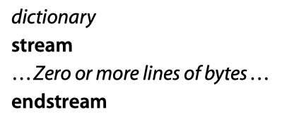
* Can read incrementally, can be of unlimited length. Objects with potentially large amounts of data, such as images and page descriptions, are represented as streams.

---
# Stream Objects (cont.)
* Every stream dictionary has a **Length** entry that indicates how many bytes of the PDF file are used for the stream’s data.
* Stream's data can be encoded, and must be decoded before it is used. These encoders/decoders are called stream **filters**.
* Commonly used filters
  - ASCIIHexDecode: data encoded in an ASCII hexadecimal representation.
  - LZWDecode: data encoded using the LZW compression method.
  - FlateDecode: data encoded using the zlib/deflate compression method.

---
# A stream object example
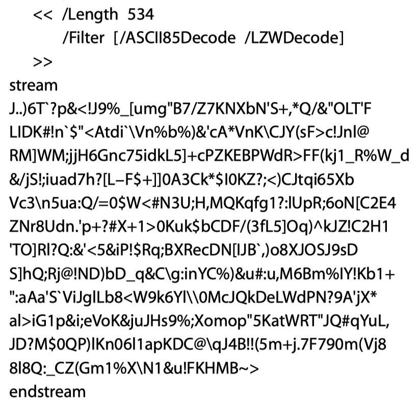

---
# Indirect Objects
* Any object in a PDF file may be labeled as an indirect object. This gives the object a **unique object identifier** by which other objects can **refer to** it.
* The definition of an indirect object in a PDF file consists of its **object number** and **generation number**, **followed by the value of the object itself** bracketed between the keywords **obj** and **endobj**.
* 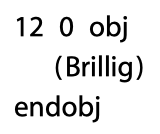

---
# Indirect Objects (cont.)
* The object can then be **referred to** from elsewhere in the file by an **indirect reference** consisting of the **object number**, the **generation number**, and the keyword **R**.
* 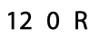

  
---
<!-- header: Ⅳ. Document Structure -->
# Document Structure
* A PDF document is orgnized in a **tree hierarchy**. The root of the tree is called **Document Catalog** and is specified by the ``/Root`` entry in trailer.
* The catalog contains references to other objects defining the document's **contents**, **outline**, article threads, named destinations, and other attributes.

---
# /Catalog
- 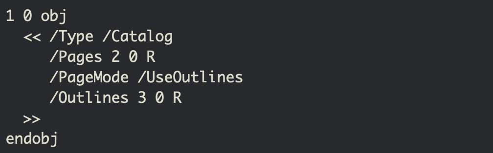
- ``/Type`` must be set to /Catalog.
- ``/Pages`` must be set to specify the document's page tree.

---
# /Pages
- 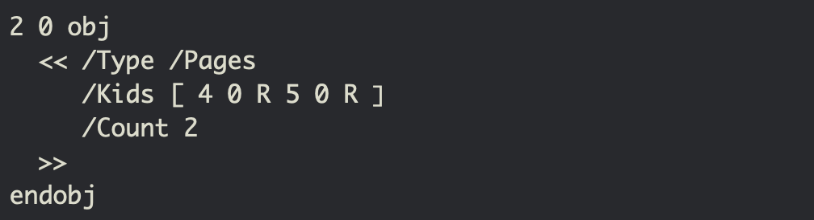
- ``/Type`` must be set to /Pages.
- ``/Kids`` array should be set to specify the child pages.
- ``/Count`` must be set to specify the number of leaf nodes (page objects).

---
# /Page
- 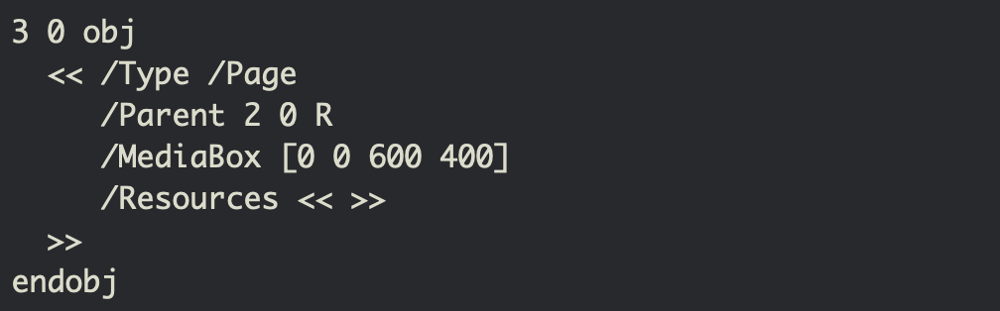
- ``/Type`` must be set to /Page.
- ``/MediaBox`` is a rectangle on the page to store media contents.
- ``/Resources`` contains any resources (e.g. fonts) that are required by this page.

---
# Content Streams
* A content stream is a PDF stream object whose data consists of a sequence of **instructions** describing the graphical elements to be painted on a page.
* These instructions use a "**postfix**" notation, in which an operator is preceded by its operands.
* An **operand** is a ***direct*** object belonging to any of the basic PDF data types except a stream.
* An **operator** is a PDF keyword that specifies some action to be performed.

---
# Content Streams (cont.)
* Each **page's content** is represented by one or more content streams. Content streams are also used to represent self-contained graphical elements, such as **forms, fonts**, etc.
* An operator may needs to refer to a object that is defined outside the content stream, such as a **font dictionary**. This can be accomplished by defining such objects as **named resources** and referring to them **by name** from within the content stream.
* A content stream's named resources are defined by a **resource dictionary**.

---
# A content stream example
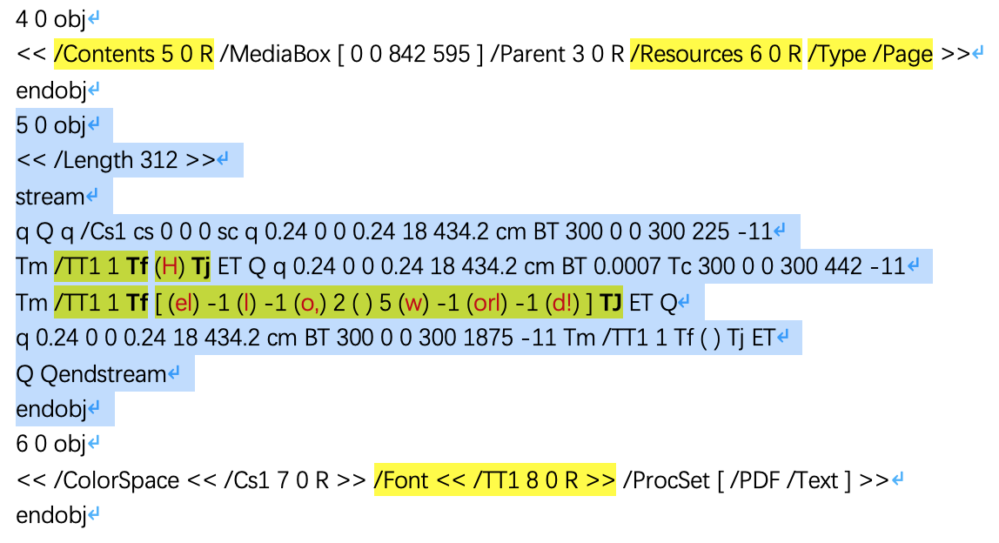

---
<!-- header: Ⅴ. Text Basics -->
# Text in PDF
* A **character** is an abstract symbol.
* A **glyph** is a specific graphical rendering of a character.
* Glyphs are organized into **fonts**.
* A font's **encoding** is the association between character codes (obtained from text strings that are shown) and glyph descriptions.

---
# Basics of Showing Text
* 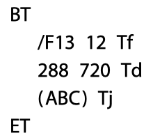
* Begin a text object.
* Set the font and font size to use.
* Specify a starting position on the page.
* Paint the glyphs for a string of characters there.
* End the text object.

---
# Text-showing operators
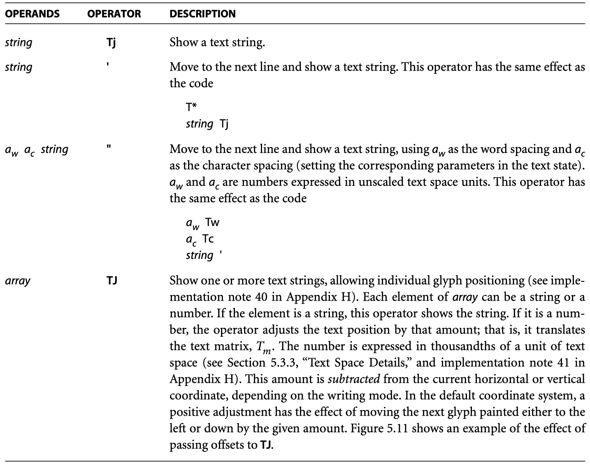

---
# PDF Font Types
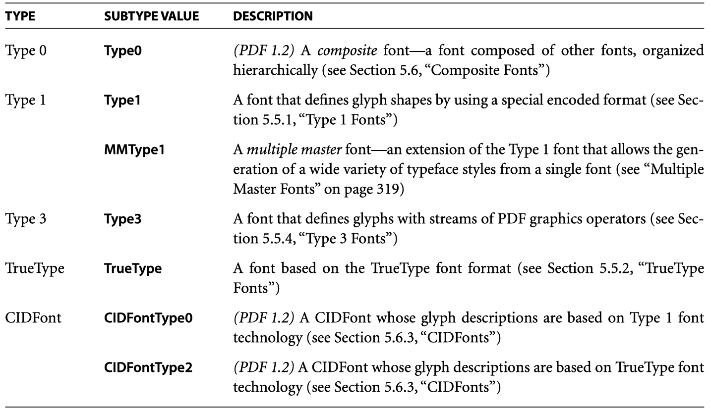

---
# PDF Font Types (cont.)
* Simple Fonts: Type 1, Type 3, TrueType
* Composite Fonts: Type 0
* CIDFont
  - not actually a font, cannot be used as the operand of the Tf operator.
  - used only as a descendant of a Type 0 font.

---
# Font Data Structures
* A font is represented in PDF as a **dictionary** specifying the type of font, its PostScript name, its encoding, and information that can be used to provide a substitute when the font program is not available.
* The font program itself can be **embedded** as a stream object.
* Two classes of font-related objects to support **CID-Keyed Fonts**:
  - CIDFonts
  - CMaps

---
# A TrueType Font dictionary
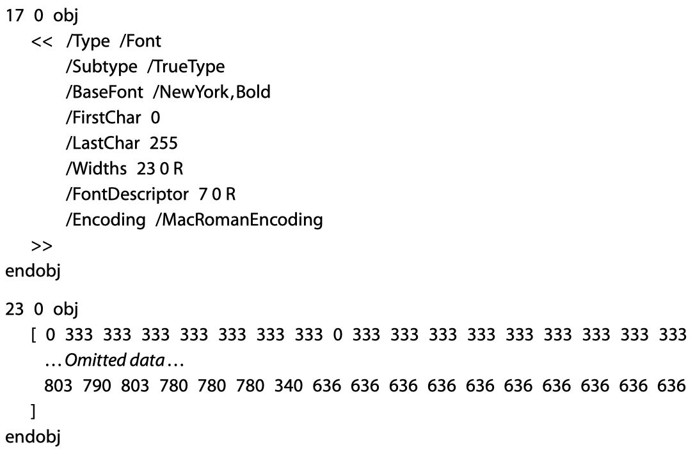

---
# CID-Keyed Fonts (Type 0)
* Provide a convenient and efficient method for defining **multiple-byte character encodings**, fonts with a large number of glyphs, and fonts that incorporate glyphs obtained from other fonts.
* **CID** (character identifier) numbers are used to index and access the glyph descriptions in the font.
* Must explicitly reference the **character collection** on which its CID numbers are based. A character collection is uniquely identified by the **Registry**, **Ordering**, and **Supplement**.
* A **CMap** (character map) file specifies the correspondence between character codes and the CID numbers used to identify characters.

---
<!-- header: Ⅵ. Glyph Selection -->
# Glyph Selection
* ``font name`` from the current text state.
* ``character codes`` from text-showing instruction.
* How to select the correct glyphs to rendering the text?
 
---
# Type 1 Font Encoding
* A Type 1 font program's glyph descriptions are keyed by **character names**.
* A **character code** is first mapped to **character name** as specified by the font's Encoding. The character name is then used to find the **glyph description**.

---
# Standard Encodings
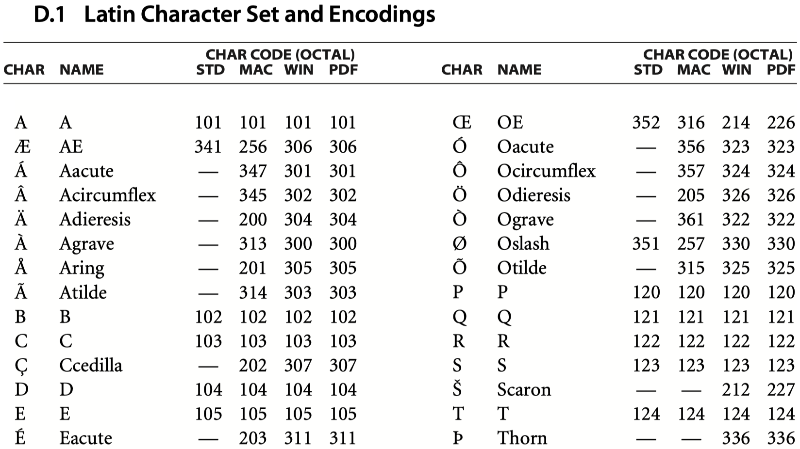

---
# Type 3 Font Encoding
* Basically the same as Type 1.

---
# TypeType Font Encoding
* A TrueType font program's "**cmap**" table contains information which maps character codes to glyph descriptions.
* The "cmap" table consists of one or more subtables.
* If a (3, 1) "cmap" subtable (Microsoft Unicode) is present, it is used as follows: A **character code** is first mapped to a **character name** as specified by the font's Encoding. The character name is then mapped to a **Unicode value** by consulting the Adobe Glyph List. Finally, the Unicode value is mapped to a **glyph description** according to the (3, 1) subtable.

---
# TypeType Font Encoding (cont.)
* If no (3, 1) subtable is present but a (1, 0) subtable (Macintosh Roman) is present, it is used as follows: A **character code** is first mapped to a **character name** as specified by the font's Encoding. The character name is then mapped back to a **character code** according to MacRomanEncoding. Finally, the code is mapped to a **glyph description** according to the (1, 0) subtable.
* In either of the cases above, a **character code** is first mapped to a **character name** as specified by the font's Encoding, the character name is looked up in the font program's "post" table (if one is present) and the associated **glyph description** is used.

---
# TypeType Font Encoding (cont. 2)
* When the font **has no Encoding entry**, or the font descriptor's **Symbolic flag is set**, the following occurs:
  - If the font contains a (3, 0) subtable, each two-bytes from the string are used to look up the associated glyph descriptions from the subtable.
  - Otherwise, if the font contains a (1, 0) subtable, single bytes from the string are used to look up the associated glyph descriptions from the subtable.
* If a character cannot be mapped in any of the ways described above, the results are **implementation-dependent**.

---
# Type 0 Font Encoding
* The **Encoding** entry of a Type 0 font dictionary must be **a predefined CMap**, or **a CMap stream** object.
* The number of bytes extracted from the string for each successive character is determined exclusively by the codespace ranges in the CMap (delimited by **begincodespacerange** and **endcodespacerange**).
* The code extracted from the string is then looked up in the character code mappings for codes of that length. (These are the mappings defined by **begincidchar**, **endcidchar**, and corresponding operators for ranges.)

---
# Glyph Selection in CIDFontType0
* The program itself contains glyph descriptions that are identified by **CIDs**.
* If the font program has a Top DICT that uses CIDFont operators: The CIDs are used to determine the GID value using the charset table. The GID value is then used to look up the glyph procedure using the CharStrings INDEX table.
* Otherwise, the CIDs are used directly as GID values, and the glyph procedure is retrieved using the CharStrings INDEX.

---
# Glyph Selection in CIDFontType2
* The program is actually a TrueType font program, which has no native notion of CIDs.
* If the TrueType font program is **embedded**, the Type 2 CIDFont dictionary must contain a **CIDToGIDMap** entry that maps **CIDs** to the **glyph indices** for the appropriate glyph descriptions in that font program.
* Otherwise, the viewer application selects glyphs by translating characters from the encoding specified by the **predefined CMap** to one of the encodings given in the TrueType font's "cmap" table. The results are **implementation-dependent**.

---
<!-- header: Ⅶ. Unicode Mapping -->
# Extraction of Text Content
* In addition to displaying text, consumer applications sometimes need to determine the information content of text.
* This need arises during operations such as **searching**, **indexing**, and **exporting** of text to other applications.
* How to mapping character codes to Unicode values?

---
# Unicode Mapping
* If the font dictionary contains a **ToUnicode CMap**, use that CMap to convert the character code to Unicode.
  - The CMap file must contain begincodespacerange and endcodespacerange operators to define the source character code range.
  - It must use the beginbfchar, endbfchar, beginbfrange, and endbfrange o tors to define the mapping from character codes to Unicode character sequences expressed in **UTF-16BE** encoding.

---
# A ToUnicode CMap example
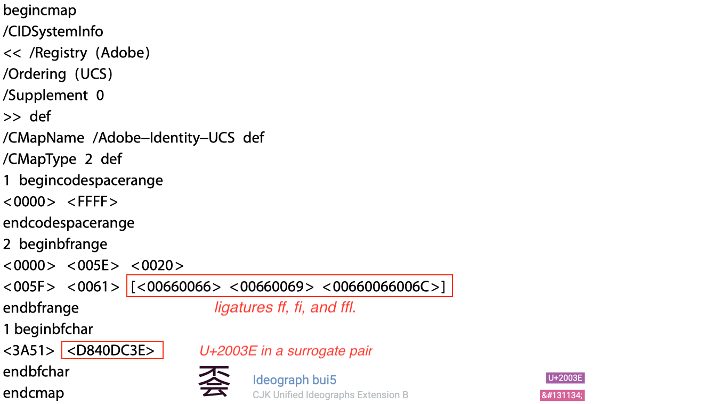

---
# Unicode Mapping (cont.)
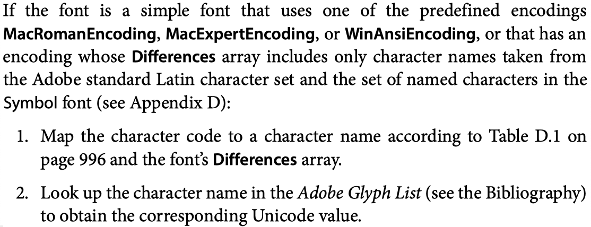

---
# Unicode Mapping (cont. 2)
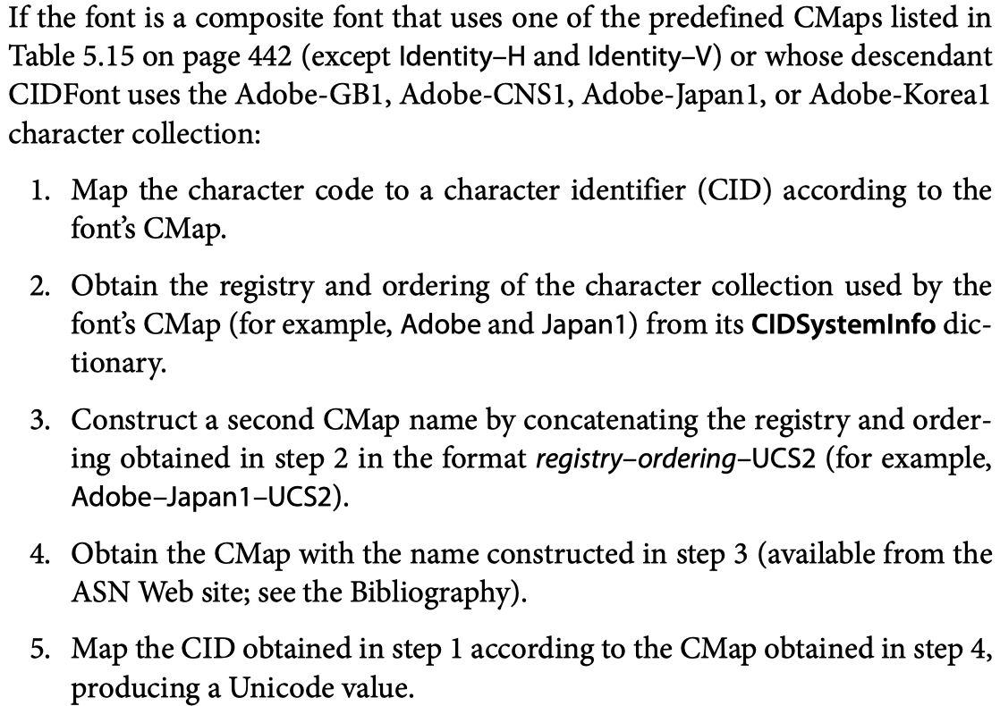

---
# Adobe-GB1-UCS2 CMap
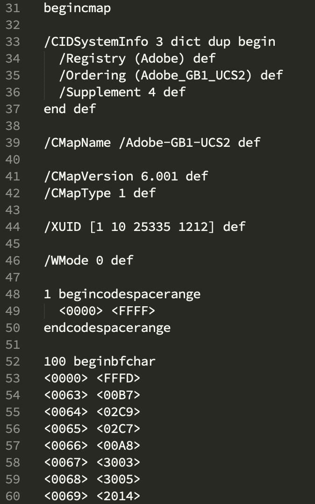

---
<!-- header: '' -->
<!-- _class: lead -->
# That's all.