<!-- _class: lead -->
# Text Rendering
zhuyie
zhuyie@gmail.com

---
# Agenda

---
<!-- paginate: true -->
# Hinting
* Glyphs displayed on a **low-resolution** surface will often show numerous **unpleasant artifacts**:
  * stem widths and heights are not consistent, even in a single character image.
  * the top and bottom of certain characters do not seem to align with the top or bottom of others.
  * curves and diagonals are generally ugly.

---
# Hinting
* Hinting (Grid-Fitting) is the general process of modifying glyph outlines in order to **align** some of their **important features** to the **pixel grid** in device space. 
* When done correctly, the quality of the final glyph bitmaps is **massively improved**. 

---
# Hinting
before:
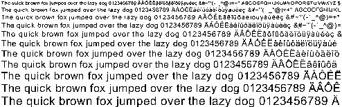
after:
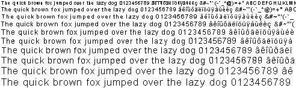

---
# Hinting
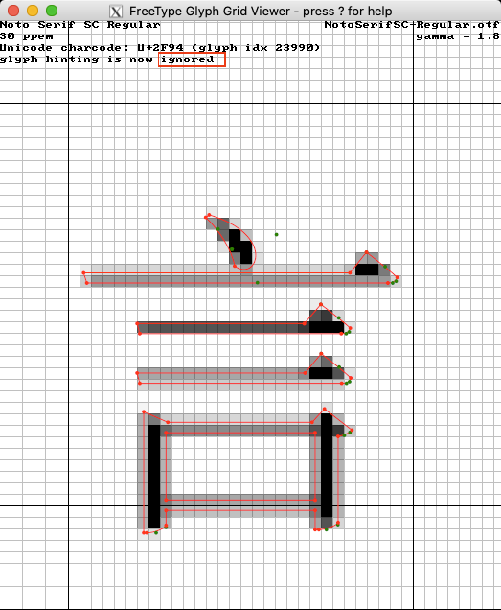 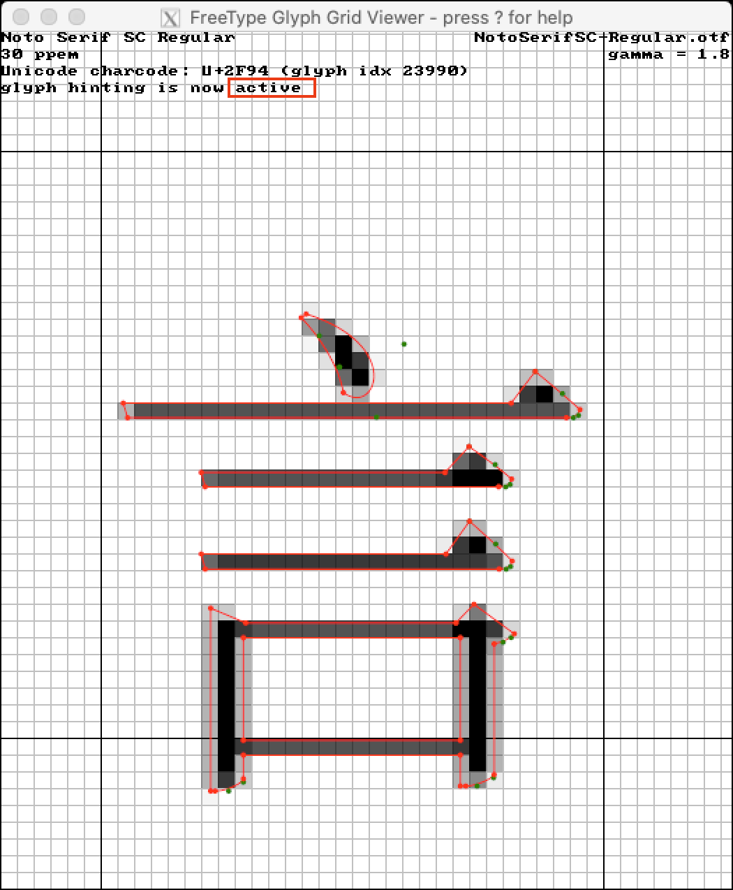

---
# Hinting
* Grid-fitting can be decomposed in two important phases:
  - detecting important glyph and font features and **produce** control data, called hints.
  - **applying** the alignment operations described in the hints.
* Traditionally, the first pass is performed when the font file is created. For example, the TrueType format associates to each glyph outline a **optional** [bytecoded program](https://docs.microsoft.com/en-us/typography/opentype/spec/glyf) which handle hinting.
* FreeType **automatic hinting module** include both a feature-detection and alignment control pass. 

---
# Hinting
[CFF2 CharString Hinting operators](https://docs.microsoft.com/en-us/typography/opentype/spec/cff2charstr#43-hint-operators)

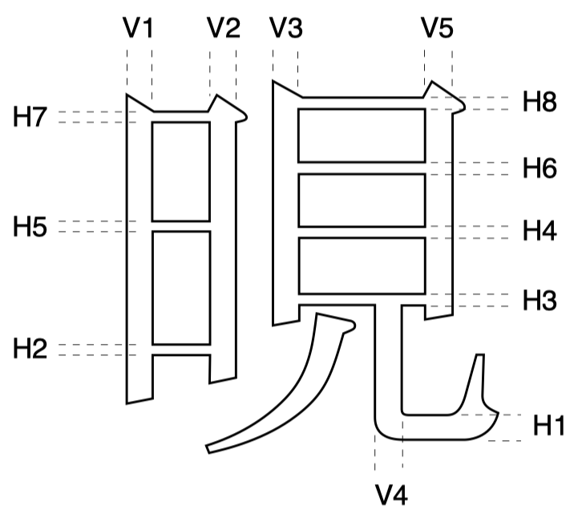 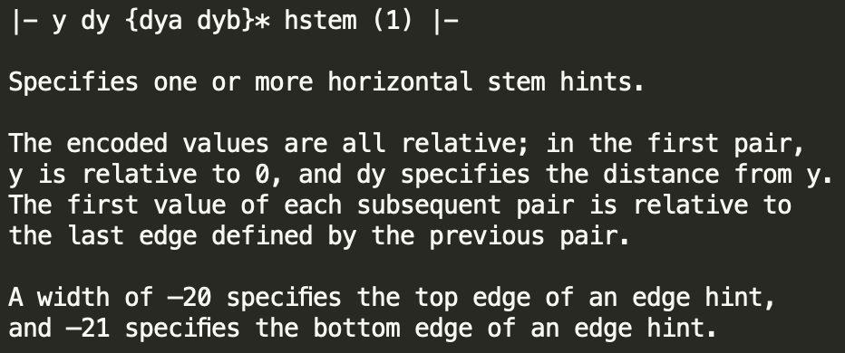 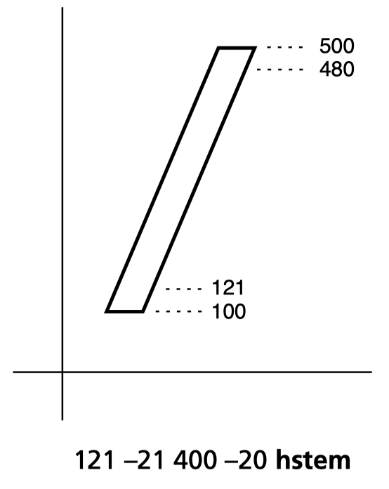

---
# Hinting
References:
[Font hinting - Wikipedia](https://en.wikipedia.org/wiki/Font_hinting)
[TrueType hinting](https://docs.microsoft.com/en-us/typography/truetype/hinting)
[The Type 2 Charstring Format](https://adobe-type-tools.github.io/font-tech-notes/pdfs/5177.Type2.pdf)
[FreeType auto-hinter](https://www.freetype.org/freetype2/docs/reference/ft2-auto_hinter.html)
[The character "热" looks bad in 15px 96dpi with fontconfig 2.10](https://github.com/adobe-fonts/source-han-sans/issues/285)

---
# SDF
* A signed distance field, or SDF for short, is the result of a signed distance transformation applied to a subset of N-dimensional space. It **maps** each point P of the space to a **scalar signed distance** value. A signed distance is defined as follows: If the point P **belongs** to the subset, it is the minimum distance to any point outside the subset. If it does **not belong** to the subset, it is **minus** the minimum distance to any point of the subset.

---
# SDF
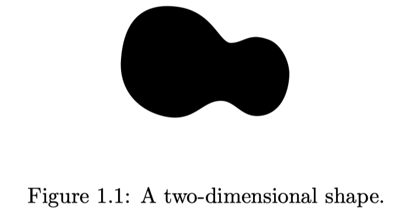 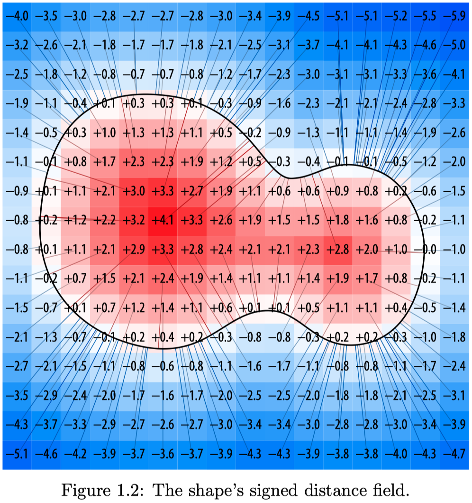

---
# SDF
* Imagine plotting a circle for each point of the grid, and using the absolute value of the signed distance as its radius.
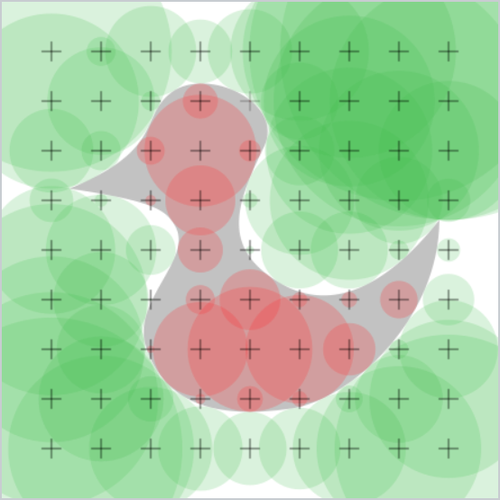
* The collective area of the negative circles lies strictly outside the shape and the area of the positive ones inside. Only the space that does not coincide with any circle is **uncertain**.

---
# SDF
* Assuming the shape is relatively **smooth**, the uncertain area can be reconstructed by taking the shortest or smoothest route.
* The distance values change very smoothly and predictably. using simple interpolation, the signed distance field grid can be sampled at **a much higher resolution**, and still provide a **good approximation** of the actual signed distances throughout the plane.
* One SDF for **all** font sizes.

---
# SDF
* Clearly, our SDF only use a finite number of discrete points, and therefore **not exact**.
* To be able to render more complex shapes such as decorative fonts we need to use a higher SDF resolution.
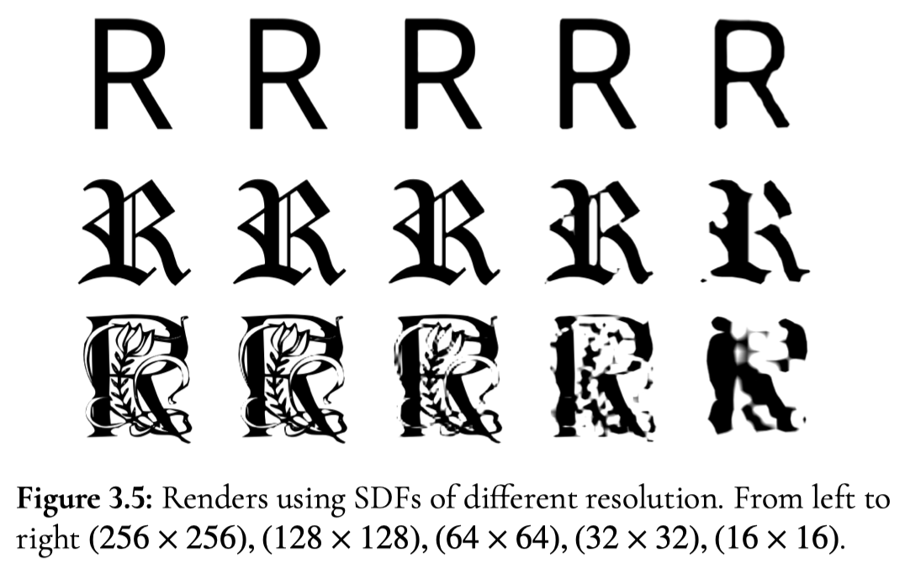

---
# SDF
* By convention, we map the signed distance into the range 0..1, with **0** representing the maximum possible negative distance and **1.0** representing the maximum possible positive distance. hence, **0.5** is generally used for the **alpha threshold value**.
* A simple SDF renderer (OpenGL fragment shader):
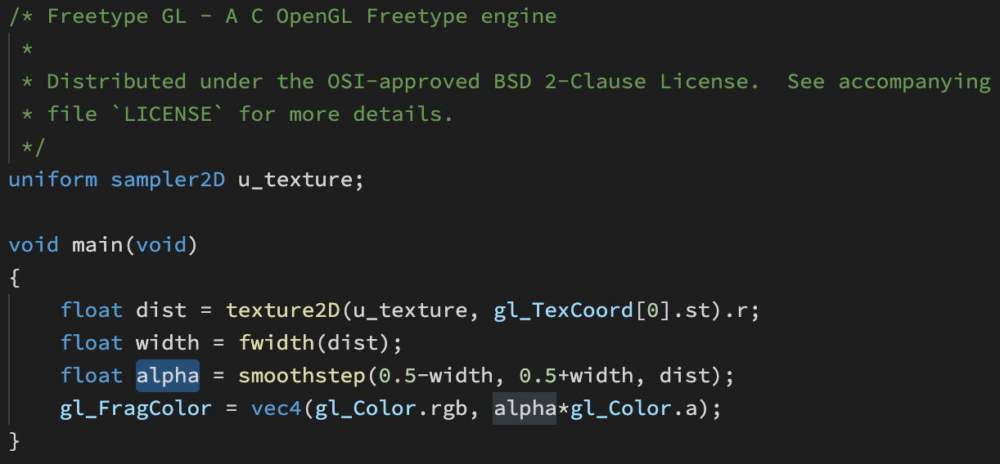

---
# SDF
* Glyph shapes often have **sharp** corners, which cause irregularities in the distance field. 
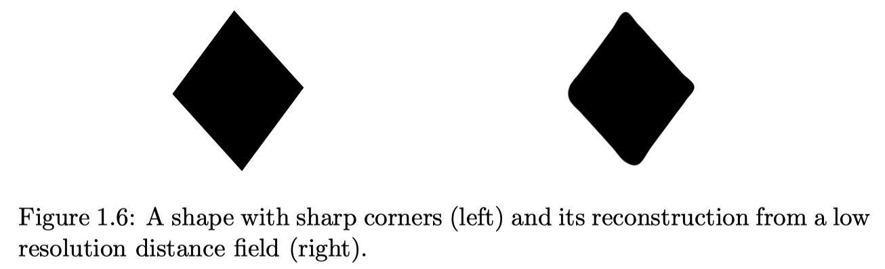
* A possible solution is to divide it into two smooth shapes, and create two separate distance fields. When reconstructing the image, one can first reconstruct the two auxiliary subshapes, and afterwards fill only those pixels that **belong in both**.
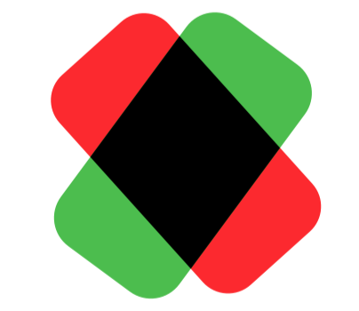

---
# SDF
* The distance fields are usually stored as monochrome images. However, image files have the ability to hold **3 or more color channels**, making it natural to encode the two separate distance fields as one image, where each channel holds one of them.
* Viktor Chlumsky proposes the **Multi-channel Distance Fields** approach in his [master's thesis](https://github.com/Chlumsky/msdfgen/files/3050967/thesis.pdf).

---
# SDF
* By utilizing all three color channels, MSDF have the ability to reproduce sharp corners almost perfectly.
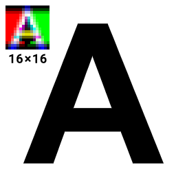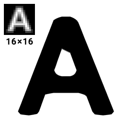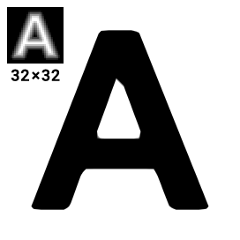
* The performance impact of using MSDF is relatively small.

---
# SDF
* There are a few minor drawbacks:
  - No support for font hinting.
  - Computing the (M)SDF is not trivially cheap.

---
# SDF
References:
[Valve paper](https://steamcdn-a.akamaihd.net/apps/valve/2007/SIGGRAPH2007_AlphaTestedMagnification.pdf)
[Drawing Text with Signed Distance Fields in Mapbox GL](https://blog.mapbox.com/drawing-text-with-signed-distance-fields-in-mapbox-gl-b0933af6f817)
[Multi-channel signed distance field generator](https://github.com/Chlumsky/msdfgen)
[FreeType Merges New "SDF" Renderer](https://www.phoronix.com/scan.php?page=news_item&px=FreeType-SDF-Renderer-Lands)