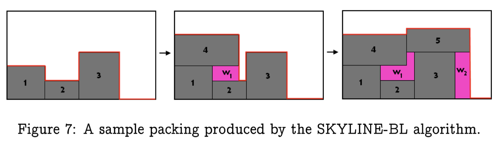
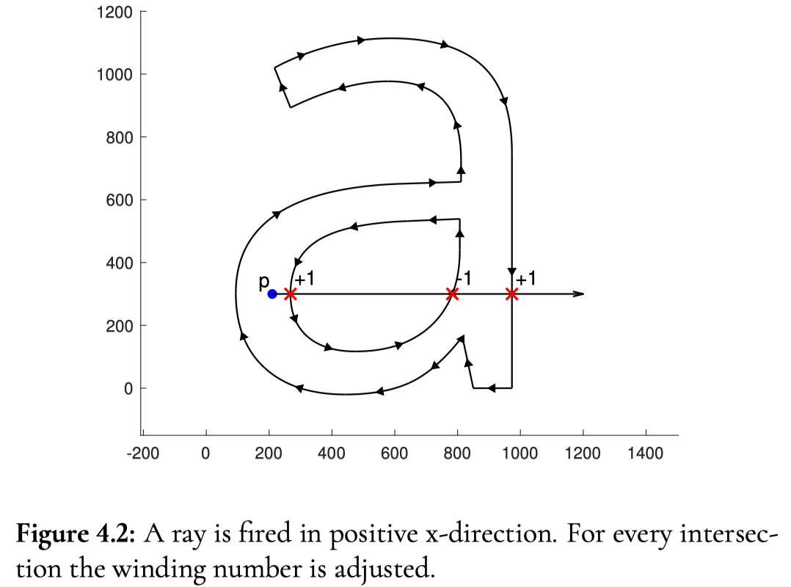

<style>
section {
  font-family: 'Avenir Next', 'Avenir', 'Trebuchet MS', 'Segoe UI', sans-serif;
}
</style>

<!-- _class: lead -->
# Text Rendering
zhuyie
zhuyie@gmail.com

---
# Agenda
- Font basics
- Naïve path renderer
- Bitmap renderer (texture renderer)
- Hinting
- SDF renderer
- New GPU-based approaches

---
<!-- paginate: true -->
# Font types
* A font is a collection of glyphs.
* **Bitmap** fonts consist of a matrix of dots or pixels representing the image of each glyph in each face and size.
* **Vector** fonts (outline fonts) use Bézier curves, drawing instructions and mathematical formulae to describe each glyph, which make the character outlines scalable to any size.
  - TrueType uses quadratic bezier curves.
  - OpenType(CFF) uses cubic bezier curves.

---
# Glyph internals
Roboto-Black.ttf


---
# Glyph internals
NotoSerifSC-Regular.otf


---
# EM & font size
* In digital type, the **EM square** is a grid of arbitrary resolution that is used as the design space of a digital font.
* A 2D coordinate system, which have an **origin** and a **unit length**.
* All points in glyph description are based on this coordinate system.

---
# EM & font size
* Different fonts may have different EM size, eg. 1000 or 2048.
* 2 inches **font size** means 1 EM is 2 inches large.
* The most common used font size unit is **point**, which is 1/72 inch.

---
# Glyph metrics


---
# Naïve path renderer
(1) Load the glyph.
(2) Build a **path** object by calling FT_Outline_Decompose.
(3) Draw the filled path object. 


---
# Naïve path renderer


---
# Naïve path renderer


---
# Naïve path renderer


---
# Naïve path renderer


---
# Naïve path renderer


---
# Naïve path renderer


---
# Naïve path renderer
* Pros
  - simple.
  - font size independent.
* Cons
  - display quality is not very good.
  - drawing lots of paths is slow.

---
# Bitmap renderer
* Although the glyph describe in **vector** form, most display devices are **raster** devices. there are always a rasterization stage.
* One glyph may displayed many instances at the same time. Use a pre-rasterized glyph and bitblt multiples times usually more efficient.
* With exact pixel boundary, we can do font hinting to improve the display quality at low screen resolutions.
* Therefore, the most common way to render glyphs is using pre-rasterized glyphs. We can call it "bitmap renderer".

---
# Bitmap renderer
- A "toy" bitmap renderer:
  * Set font size (FT_Set_Char_Size/FT_Set_Pixel_Sizes).
  * Load the glyph (FT_Load_Char/FT_Load_Glyph).
  * Convert the given glyph image to a bitmap (FT_Render_Glyph). The default render mode renders an anti-aliased coverage bitmap with 256 gray levels (also called a **pixmap**).
  * Build a corresponding **bitmap** from the pixmap.
  * Draw the bitmap.

---
# Bitmap renderer


---
# Bitmap renderer
 

---
# Bitmap renderer
[Scanline rendering - Wikipedia](https://en.wikipedia.org/wiki/Scanline_rendering)
[How FreeType's rasterizer work](https://gitlab.freedesktop.org/freetype/freetype/-/blob/master/docs/raster.txt)
[FreeType's new 'perfect' anti-aliasing renderer](https://gitlab.freedesktop.org/freetype/freetype/-/blob/master/src/smooth/ftgrays.c)

---
# Bitmap renderer
* In practice, we should store the generated pixmap somewhere (eg. a **LRU cache**) and query it whenever we want to render a glyph.
* The pixmap generated by FreeType is just large enough to contain the visible part of a glyph, which do not have the same size. so some **metrics** should be stored as well:
  - bitmap.width: the width of the bitmap.
  - bitmap.rows: the height of the bitmap.
  - bitmap_left: the horizontal offset (relative to the origin).
  - bitmap_top: the vertical offset (relative to the origin).

---
# Bitmap renderer
* Modern computers have **GPU** which is very good at processing pixels and bilinear interpolation. We could use graphics API like OpenGL to implement a GPU based bitmap renderer.
* In OpenGL(DirectX/Vulkan), the most natural way to represent a glyph pixmap is using **texture**. Build a 2D texture from a pixmap, then do texture sampling in fragment shader.
* To draw a glyph quad, we can divide the rectangle into two triangles. 
```1 texture + 6 vertices (position and corresponding texture coordinate) ==> 1 glyph quad```

---
# Bitmap renderer
Code snippets from [OpenGL Text Rendering](https://learnopengl.com/In-Practice/Text-Rendering)


---
# Bitmap renderer


---
# Bitmap renderer
 

---
# Bitmap renderer
* One texture per glyph means lots of **texture switching**, which can hurt GPU performance. A better way is to have a single, large texture that contains lots of glyphs.
* A **texture atlas** is basically a big texture which contains many small images that are packed together.
* Glyphs may have different sizes, we need a **bin packing** algorithm.
* [A Thousand Ways to Pack the Bin - A Practical Approach to Two-Dimensional Rectangle Bin Packing](https://github.com/juj/RectangleBinPack/blob/master/RectangleBinPack.pdf)

---
# Bitmap renderer



---
# Bitmap renderer
[Freetype-GL](https://github.com/rougier/freetype-gl) uses skyline bottom left.


---
# Bitmap renderer


---
# Bitmap renderer
* Pros
  - good display quality.
  - pretty fast.
* Cons
  - pre-rasterized glyphs are **font size dependent**.
  - relatively complex.

---
# Hinting
* Glyphs displayed on a **low-resolution** surface will often show numerous **unpleasant artifacts**:
  * stem widths and heights are not consistent, even in a single character image.
  * the top and bottom of certain characters do not seem to align with the top or bottom of others.
  * curves and diagonals are generally ugly.

---
# Hinting
* Hinting (Grid-Fitting) is the general process of modifying glyph outlines in order to **align** some of their **important features** to the **pixel grid** in device space. 
* When done correctly, the quality of the final glyph bitmaps is **massively improved**. 

---
# Hinting
before:

after:


---
# Hinting
 

---
# Hinting
* Grid-fitting can be decomposed in two important phases:
  - detecting important glyph and font features and **produce** control data, called hints.
  - **applying** the alignment operations described in the hints.
* Traditionally, the first pass is performed when the font file is created. For example, the TrueType format associates to each glyph outline a **optional** [bytecoded program](https://docs.microsoft.com/en-us/typography/opentype/spec/glyf) which handle hinting.
* FreeType **automatic hinting module** include both a feature-detection and alignment control pass. 

---
# Hinting
[CFF2 CharString Hinting operators](https://docs.microsoft.com/en-us/typography/opentype/spec/cff2charstr#43-hint-operators)

  

---
# Hinting
References:
[Font hinting - Wikipedia](https://en.wikipedia.org/wiki/Font_hinting)
[TrueType hinting](https://docs.microsoft.com/en-us/typography/truetype/hinting)
[The Type 2 Charstring Format](https://adobe-type-tools.github.io/font-tech-notes/pdfs/5177.Type2.pdf)
[FreeType auto-hinter](https://www.freetype.org/freetype2/docs/reference/ft2-auto_hinter.html)
[The character "热" looks bad in 15px 96dpi with fontconfig 2.10](https://github.com/adobe-fonts/source-han-sans/issues/285)

---
# SDF
* A signed distance field, or SDF for short, is the result of a signed distance transformation applied to a subset of N-dimensional space. It **maps** each point P of the space to a **scalar signed distance** value. A signed distance is defined as follows: If the point P **belongs** to the subset, it is the minimum distance to any point outside the subset. If it does **not belong** to the subset, it is **minus** the minimum distance to any point of the subset.

---
# SDF
 

---
# SDF
* Imagine plotting a circle for each point of the grid, and using the absolute value of the signed distance as its radius.

* The collective area of the negative circles lies strictly outside the shape and the area of the positive ones inside. Only the space that does not coincide with any circle is **uncertain**.


---
# SDF
* Assuming the shape is relatively **smooth**, the uncertain area can be reconstructed by taking the shortest or smoothest route.
* The distance values change very smoothly and predictably. using simple interpolation, the signed distance field grid can be sampled at **a much higher resolution**, and still provide a **good approximation** of the actual signed distances throughout the plane.
* One SDF for **all** font sizes.

---
# SDF
* Clearly, our SDF only use a finite number of discrete points, and therefore **not exact**.
* To be able to render more complex shapes such as decorative fonts we need to use a higher SDF resolution.


---
# SDF
* By convention, we map the signed distance into the range 0..1, with **0** representing the maximum possible negative distance and **1.0** representing the maximum possible positive distance. hence, **0.5** is generally used for the **alpha threshold value**.
* A simple SDF renderer (OpenGL fragment shader):


---
# SDF
* Glyph shapes often have **sharp** corners, which cause irregularities in the distance field. 

* A possible solution is to divide it into two smooth shapes, and create two separate distance fields. When reconstructing the image, one can first reconstruct the two auxiliary subshapes, and afterwards fill only those pixels that **belong in both**.


---
# SDF
* The distance fields are usually stored as monochrome images. However, image files have the ability to hold **3 or more color channels**, making it natural to encode the two separate distance fields as one image, where each channel holds one of them.
* Viktor Chlumsky proposes the **Multi-channel Distance Fields** approach in his [master's thesis](https://github.com/Chlumsky/msdfgen/files/3050967/thesis.pdf).

---
# SDF
* By utilizing all three color channels, MSDF have the ability to reproduce sharp corners almost perfectly.

* The performance impact of using MSDF is relatively small.

---
# SDF
* There are a few minor drawbacks:
  - No support for font hinting.
  - Computing the (M)SDF is not trivially cheap.

---
# SDF
References:
[Valve paper](https://steamcdn-a.akamaihd.net/apps/valve/2007/SIGGRAPH2007_AlphaTestedMagnification.pdf)
[Drawing Text with Signed Distance Fields in Mapbox GL](https://blog.mapbox.com/drawing-text-with-signed-distance-fields-in-mapbox-gl-b0933af6f817)
[Multi-channel signed distance field generator](https://github.com/Chlumsky/msdfgen)
[FreeType Merges New "SDF" Renderer](https://www.phoronix.com/scan.php?page=news_item&px=FreeType-SDF-Renderer-Lands)

---
# Loop Blinn Curve Rendering
C. Loop, J. Blinn, ["Resolution Independent Curve Rendering using Programmable Graphics Hardware"](https://www.microsoft.com/en-us/research/wp-content/uploads/2005/01/p1000-loop.pdf)


---
# Loop Blinn Curve Rendering
- The triangulation step is quite complicated and for complicated glyphs the triangle count could reach large numbers for each glyph.
- At small sizes when several of the outline curve segments intersect a pixel, the pixel shader will only use one of them to determine the color.
- Anti-aliasing requires additional triangles to be added to the outside of the glyph mesh or the use of super sampling.

---
# Slug Algorithm
E. Lengyel, ["GPU-Centered Font Rendering Directly from Glyph Outlines"](http://terathon.com/i3d2018_lengyel.pdf)
 

---
# Slug Algorithm
- For a closed curve in a 2D plane, the **winding number** for a point p is the number of times the curve loops clockwise around the point.
- In general, a glyph shape can be **sampled** at any point by determining the winding number.
- One way to compute the winding number of a point p is to shoot a ray in any direction, originating from p.
- Then a non-zero winding number indicates that the point is inside the glyph shape, otherwise it is outside.
- Many times **slower** than the pixmap texture based methods.

---
<!-- _class: lead -->
# Thanks
