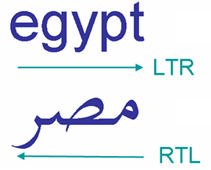
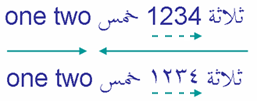

<!-- _class: lead -->
# Unicode: not only a Charset
zhuyie
zhuyie@gmail.com

---

---
# Agenda
- Legacy Charsets
- A Brief History of Unicode
- The Unicode Code Space & Encodings
- Combining Character Sequence & Normalization
- CJK Unified Ideographs
- BIDI

---
<!-- paginate: true -->
# Terminology
* A **character** is a minimal unit of text that has semantic value.
* A **character set** is a collection of characters that might be used by multiple languages. Example: The Latin character set is used by English and most European languages.
* A **coded character set** is a character set in which each character corresponds to a unique number.
* A **code point** of a coded character set is any allowed value in the character set or code space.
* A **code space** is a range of integers whose values are code points.

---
# Terminology (cont.)
* A **code unit** is the unit of storage of a part of an encoded code point. In UTF-8 this means 8-bits, in UTF-16 this means 16-bits. A single code unit may represent a full code point, or part of a code point.
* **character encoding form**: Mapping from a character set definition to the actual code units used to represent the data.
* **character encoding scheme**: A character encoding form plus byte serialization. There are seven character encoding schemes in Unicode: UTF-8, UTF-16, UTF-16BE, UTF-16LE, UTF-32, UTF-32BE, and UTF-32LE.

---
# Terminology (cont. 2)
* A **language** is a structured system of communication.
* A **script** is a collection of letters and other written signs used to represent textual information in one or more writing systems. For example, Russian is written with a subset of the Cyrillic script; Ukranian is written with a different subset. The Japanese writing system uses several scripts.
* A **writing system** is a set of rules for using one or more scripts to write a particular language. Examples include the American English writing system, the British English writing system, the French writing system, and the Japanese writing system.

---
# Terminology (cont. 3)
* A **grapheme/grapheme cluster** is a sequence of one or more code points that are displayed as a single, graphical unit that a reader recognizes as a single element of the writing system. For example, both **a** and **ä** are graphemes, but they may consist of multiple code points.
* A **glyph** is an image, usually stored in a font (which is a collection of glyphs), used to represent graphemes or parts thereof.

---
# ASCII
* **A**merican **S**tandard **C**ode for **I**nformation **I**nterchange
* 初版发布于1963年，已经被标准化为[ISO/IEC 646](https://en.wikipedia.org/wiki/ISO/IEC_646)。
* 

---
# ISO 8859-1
* [ISO 2022](https://en.wikipedia.org/wiki/ISO/IEC_2022)在维持对ASCII兼容的基础上，设计出支持多字节字符集(MBCS)的架构。GB2312编码也符合此框架。
* [ISO 8859](https://en.wikipedia.org/wiki/ISO/IEC_8859)兼容于ASCII，是基于ISO 2022的架构在G1区定义出16套扩展字符而形成的字符集。其中ISO 8859-1用于支持西欧语言。

---
# Windows CP1252
* 操作系统厂商例如Microsoft/IBM都会设计自己的字符集。Microsoft在ISO 8859-1的基础上又增加了27个符号，定义出[Code Page 1252](https://en.wikipedia.org/wiki/Windows-1252)。

---
# GB2312/GBK/GB18030
* [GB2312](https://zh.wikipedia.org/wiki/GB_2312)由中国国家标准总局于1980年发布，共收录6763个汉字。
* GB2312对所收录汉字进行了“分区”处理，每区含有94个汉字／符号，共计94个区，因此也称为“区位码”。
* GB2312字符串通常使用符合ISO 2022架构的[EUC-CN](https://en.wikipedia.org/wiki/Extended_Unix_Code#EUC-CN)方式存储。每个汉字采用2个字节表示，将码点的“区”值加上160得到高字节，“位”值加上160得到低字节。
* GBK和GB18030是对GB2312字符集的扩展标准。
* [Windows CP936](https://en.wikipedia.org/wiki/Code_page_936_(Microsoft_Windows))能支持绝大多数的GBK字符。

---
# Charset detection
* 由于存在着数十上百种字符集，也不存在统一的标识机制，很多时候需要使用字符集检测技术。
* 并不是一个非常简单的流程。Mozilla有一篇这个领域里面比较有名的[论文](https://www-archive.mozilla.org/projects/intl/universalcharsetdetection)，组合使用了三类方法：
  - Coding scheme method
  - Character Distribution
  - 2-Char Sequence Distribution
* 参考[uchardet](https://github.com/BYVoid/uchardet/)。

---
# What is Unicode?
[Unicode](https://en.wikipedia.org/wiki/Unicode) is an information technology (IT) **standard for the consistent encoding, representation, and handling of text expressed** in most of the world's writing systems. The standard is maintained by the **Unicode Consortium**, and as of March 2020, there is a total of 143,859 characters, with Unicode 13.0 covering 154 modern and historic scripts, as well as multiple symbol sets and emoji. The character repertoire of the Unicode Standard is **synchronized with ISO/IEC 10646**, and both are code-for-code identical.

---
# A Brief History of Unicode
* 1984年，一个工作组开始准备ISO/IEC 10646，试图解决传统字符集的各类问题。这个工作组的正式名称是：ISO/IEC JTC1/SC2/WG2 (that's "ISO/IEC Joint Technical Committee #1 [Information Technology], Subcommittee #2 [Coded Character Sets], Working Group #2 [Multioctet codes]"), or just "**WG2**" for short.
* 1988年，另一个由Xerox, Apple等公司的技术人员组成的小组也开始做类似的事情，他们的工作基于Xerox早期的XCCS编码标准。其中来自Xerox的Joe Becker的论文中首次提到了"**Unicode**"这个词。这个小组也就是今天"Unicode Consortium"的前身。

---
# A Brief History of Unicode (cont.)
* 尽管有着类似的目标，两个团队的技术方案却有着较大的差异。
* ISO 10646的初始版本采用4字节的code point，但对每个字节的部分取值范围做了禁用，其实际code space为：192(groups) x 192(planes) x 192(rows) x 192(cells)。
* 由于采用了4字节的code point，为了节省存储空间而引入了多种复杂的编码方式。
* 引入了"**B**asic **M**ultilingual **P**lane"的概念。
* 将简中、繁中、日文、韩文分配到不同的plane。

---
# A Brief History of Unicode (cont. 2)
* 另一方面，初始版本的Unicode基于2字节的code point设计，大致等价于ISO 10646中的1个plane。
* 对字节的取值范围没有额外限制，因此最大可编码65536个字符。
* 也没有定义其它编码方式，就是每个字符占用2字节。UTF-8之类的编码方式是后面才引入的。
* 对于汉字，Unicode尝试建立一个CJKV中的公共汉字字符子集，并进行统一编码。其思路类似于只分配一个'A'的code point，虽然它同时存在于English, Spanish, French, Italian, German...

---
# A Brief History of Unicode (cont. 3)
* ISO 10646的初始投票没有获得通过~~~
* 两个团队开始讨论技术融合方案：
  - 保留了ISO 10646的32-bit code space，但去掉了单个字节的取值范围限制。
  - 编码方式进行了简化，只保留UCS-4和UCS-2(仅支持BMP)。
  - 采用了Unicode的统一汉字编码方案，并将其放入到BMP中。
* 从1991年开始，两个团队开始做技术方案和码点的统一，使得"Universal Character Set"和"The Unicode Standard"这两个标准在常规使用层面上是等价的，并在后继的演进中维持了同步。

---
# The Unicode Codespace
* 当前最新的Unicode版本是13.0 (March 2020)。
* 共定义了17个平面(planes)，每个平面包含256 x 256个码点(code points)，理论上最大支持的码点(code points)个数为：17 x 65536 = 1,114,112。
* 当前一共给143,859个字符(characters)分配了码点，分属于154种文字(scripts)。

---
# The Unicode Codespace (cont.)
 

---
# The Unicode Codespace (cont. 2)

---
# UTF-32
* "UTF" stands for "Unicode Transformation Format".
* Unicode的码点取值范围：U+0000到U+10FFFF。
* UTF-32用4字节整数表示1个code point。
* 需要考虑字节序：UTF-32BE/UTF-32LE。
* 逻辑简单，例如求字符串长度和取字符串中第n个字符都是O(1)的复杂度。
* 由于常用字符都集中在BMP中，单个字符占用4字节是巨大的浪费，实际使用不广泛。

---
# UTF-16
* 初始版本采用2字节整数表示1个code point，因此其表示范围为U+0000到U+FFFF，也即仅能表示BMP中的字符。
* 同样需考虑字节序：UTF-16BE/UTF-16LE。
* 存储效率适中，逻辑简单。微软选择UTF-16作为Windows中Unicode文本的标准编码方式。

---
# UTF-16 (cont.)
* 然而，不能表示BMP之外的字符是个巨大的缺陷，例如生僻汉字、emoji等等。
* 在Unicode 2.0中引入了**surrogates**，也称为surrogate pairs，使得在UTF-16中可以完整表示所有的Unicode code point。
* surrogates通过两个连续的code unit（也即两个连续的uint16），来表示一个值大于U+FFFF的码点。
* 在增强表示能力的同时，它也增加了UTF-16的复杂度。计算字符串长度等操作不再是O(1)复杂度了。

---
# UTF-16 (cont. 2)
* 一个surrogate pair分为high和low两个部分，其二进制形式为110110**xxxxxxxxxx** 110111**yyyyyyyyyy**
* 已知Unicode码点的范围是[0, 0x10FFFF]。给定一个值大于U+FFFF的码点，将其值减去0x10000，结果的范围是[0, 0xFFFFF]，也即可以用**20个bit**来表示。将这20个bit分为高低两个10bit的部分，分别代入上面的xxxxxxxxxx和yyyyyyyyyy中，就得到了对应的surrogate。

---
# UTF-8
* 由 Ken Thompson 和 Rob Pike 在贝尔实验室的 Plan9 操作系统中首次实现。
* 是一种基于单字节(8 bit)编码单元、可变长度的Unicode字符编码方式。
* 与ASCII直接兼容，在储存英文字符串时空间效率高，是当今Internet和Linux世界的事实字符编码标准。

---
# UTF-8 (cont.)
* 首字节高位为0时，表明此code point用1个字节表示。
* 首字节高位为1时，有几个连续的1就说明此code point用几个连续字节来表示。
* 后继字节高2位为10，并带有6-bit的有效数据。
* 

---
# UTF-7
[UTF-7](https://en.wikipedia.org/wiki/UTF-7) (7-bit Unicode Transformation Format) is an **obsolete** variable-length character encoding for representing Unicode text using a stream of ASCII characters. It was originally intended to provide a means of encoding Unicode text **for use in Internet E-mail messages** that was more efficient than the combination of UTF-8 with quoted-printable.

---
# BOM
* Byte Order Mark 是一串特定的字节序列，通常放置于字符串的开始处，用来标识后继字符串的字节序。
* UTF-8这种单字节的编码理论上不存在字节序的问题，但为了更方便的进行字符串编码方式的识别，也设计了对应的BOM。
* BOM是可选的，不一定存在。
* 

---
# Combining character sequence
* 某些文字中会用到变音符号，例如：Café, Jalapeño, TÜV
*  → 
* Unicode包含一类被称为"combining marks"的字符，它们可以与基字符(base character)进行组合。例如得到一个带变音符号的拉丁字母。

---
# CCS (cont.)
* "Combining marks"字符总是与它前面的字符进行组合。

* 当基字符有多个attachable slots时，mark字符的顺序不影响结果。

---
# CCS (cont. 2)
* 当多个mark字符attach到同一位置时，其先后顺序对结果有影响。

---
# Precomposed characters
* 但是为了**向后兼容**，Unicode也包括了一堆已经预先组合好的字符，直接分配了码点。

* 一脸懵，感觉刚才这一堆聪明事都白做了...

---
# Unicode equivalence
* **Canonical equivalence** is a fundamental equivalency between characters or sequences of characters which represent the same abstract character, and which when correctly displayed should always have the same visual appearance and behavior.

---
# Unicode equivalence (cont.)
* **Compatibility equivalence** is a weaker type of equivalence between characters which represent the same abstract character, but which may have distinct visual appearances or behaviors.

---
# Normalization Forms
* [Unicode Normalization Forms](https://unicode.org/reports/tr15/) are formally defined normalizations of Unicode strings which make it possible to determine whether any two Unicode strings are **equivalent** to each other.

---
# Normalization Forms (cont.)
 

---
# Normalization Forms (cont. 2)

---
# Normalization Forms (cont. 3)
* The [Unicode Normalization Algorithm](https://unicode.org/reports/tr15/#Description_Norm) is fairly complex.
* Use library, e.g. [ICU](http://site.icu-project.org/home)
* 

---
# Grapheme Clusters
* 如前所述，在Unicode中一个**用户所感知的字符**可能有多种底层表示方式。我们将这样的"字符"称为"Grapheme Cluster"，其具体定义见[UAX #29](http://www.unicode.org/reports/tr29/)。
* 显而易见，在文本编辑领域需要细致的处理，以确保光标的位置以及选中区域的边界，能正确的落在grapheme cluster boundary上。
* 另一种情况是字符串超过长度限制需要进行截断处理时（例如数据库字段限制最多xx字节）。首先需要在code point边界上进行截断（例如不能在UTF-8的多个字节序列中，否则会导致非法字符串），然后需要考虑grapheme cluster边界以免改变字符逻辑含义。

---
# CJK Unified Ideographs
* 东亚文字多为表意文字，通常字符个数众多，且历史悠久，存在各种文化变迁与融合。
* 以汉字为例，就存在于简体中文、繁体中文、日文、韩文和越南文中。相互之间存在交集，但并不相同。
* Unicode一开始基于2字节Code space来设计，最大支持65536个码点，其中的20940(～32%)被保留给CJK文字。这些空间明显不能支持全部的CJK字符，因此通过[Han unification](https://en.wikipedia.org/wiki/Han_unification)将CJK中的交集部分尽可能统一化，以减少总的字符个数。

---
# CJK Unified Ideographs (cont.)
* Unicode为CJK文字分配码点的[3轴哲学](https://en.wikipedia.org/wiki/Z-variant)：
  * X-variants: 语义上不同的字符，例如：U+6C49 **汉** 和 U+5B57 **字**。
  * Y-variants: 语义上相同但**外观差异明显**的字符，例如：U+732B **猫** 和 U+8C93 **貓**。
  * Z-variants: 语义上相同且**外观差异细微**的字符，例如：U+8358 **荘** 和 U+838A **莊**，U+8AAC **説** 和 U+8AAA **說**。
* Z-variants理论上应该被统一，但基于兼容性等因素而独立分配了码点（从某旧字符编码字符串转换为Unicode再转回来，尽量无损）。

---
# CJK Unified Ideographs (cont. 2)
* 虽然存在基础原则，在实践中某些字符是否要统一，仍然受到各种复杂因素的影响。
* 某些被统一了码点的字符，在不同语言的书写习惯上仍可能不同。例如U+8FD4:

* 使得无法简单的基于code point来选择字体，必须再附加上locale上下文。增加了text stack的实现复杂度（例如font fallback时）。

---
# CJK Unified Ideographs (cont. 3)
* Unicode 13.0中定义了92,856个CJK统一表意字符。
* Block **CJK Unified Ideographs** (4E00–9FFF) contains 20,989 basic Chinese characters.
* Block **CJK Unified Ideographs Extension A** (3400–4DBF) contains 6,592 additional characters.
* Block **CJK Unified Ideographs Extension B** (20000–2A6DF) contains 42,718 characters.
* ...
* Block **CJK Unified Ideographs Extension G** (30000-3134F) contains 4,939 characters.

---
# BIDI
* BIDI是Unicode Bidirectional Algorithm的简称。
* 不同的文字有不同的书写方向，通常为LTR和RTL。

* 当具有不同书写方向的文字混合在一行时，就需要引入bidi算法。

* 与此同时，底层字符串中的存储顺序并不理解文字方向。

---
# BIDI (cont.)
* 在细化到具体文字的方向之前，首先需要确定**基础书写方向(Base Direction)**，或者说上下文方向。
* Base Direction = LTR

* Base Direction = RTL

---
# BIDI (cont. 2)
* 每一个Unicode字符都被赋予了一个方向性属性。

---
# BIDI (cont. 3)
* 位于两个方向**相同**的强类型字符之间的中性字符(例如空格)，将**跟随**强类型字符的方向性。

* 若某个中性字符，位于两个方向**相反**的强字符之间呢？这时候受基础方向（上下文）控制。

* 有些时候的效果不是我们想要的：

---
# BIDI (cont. 4)
* 数字通常是弱类型的字符，其方向性是确定的。

* 某些字符根据当前的文字方向具有**镜像**的显示效果，例如下图中的尖括号（在两行中使用的都是完全相同的字符）。

---
# BIDI (cont. 5)
* 某些场景需要显式的进行方向控制，因此Unicode设计了Explicit Markers字符：

* OVERRIDE类的Marker可以强制改变文字方向：

---
# BIDI (cont. 6)
* BIDI在光标移动、文字块选时也有非常多的逻辑要处理。
* 参考[UAX #9](https://unicode.org/reports/tr9/)
* Use library, e.g. [ICU](http://site.icu-project.org/home), [GNU FriBidi](https://github.com/fribidi/fribidi).

---
# Trojan Source
* A new type of attack in which **source code** is maliciously encoded so that it appears different to a compiler and to the human eye.
* By injecting unicode **Bidi override** characters into **comments** and **string literals**, an adversary can produce syntactically-valid source code for which the **display order** of characters presents logic that **diverges from the real logic**.
* **Homoglyphs** in function names could be used to define distinct functions whose names appeared to the human eye to be the same.

---
# Trojan Source (cont.)
* Paper: https://trojansource.codes/trojan-source.pdf
* Four general types of exploits:
  * Early Returns
  * Commenting-Out
  * Stretched Strings
  * Homoglyph Attacks

---
# Trojan Source (cont. 2)

---
# Trojan Source (cont. 3)

---
# Trojan Source (cont. 4)

---
# Trojan Source (cont. 5)

---
# Ideographic Description Sequence
* 表意文字由部首和笔划组成。Unicode定义了一类用来描述部首组合形式的字符(Ideographic Description Char)，例如：⿰, ⿱, ⿴。
* 基于IDS数据库可以得到某个表意文字的**表意组字序列**。
* 

---
# Emoji diversity
* Unicode Emoji的技术方案相当复杂，具体参考[UTS #51](http://www.unicode.org/reports/tr51/index.html)。
* 举个例子，Emoji中包括很多"头像"，需要在技术方案上考虑肤色多样性。
* 

---
# Some interesting unicode characters
* chess pieces: ♔ ♕ ♖ ♗ ♘ ♙ ♚ ♛ ♜ ♝ ♞ ♟
* playing card suits: ♡ ♢ ♤ ♧ ♥ ♦ ♠ ♣
* mahjong tiles: 🀀 🀁 🀂 🀃 🀅 🀟 🀩
* dice: ⚀ ⚁ ⚂ ⚃ ⚄ ⚅
* weather symbols: ☀ ☁ ☂ ☃ ☄
* musical symbols: ♩ ♪ ♫ ♬ ♭ ♮ ♯

---
<!-- _class: lead -->
# Thanks
